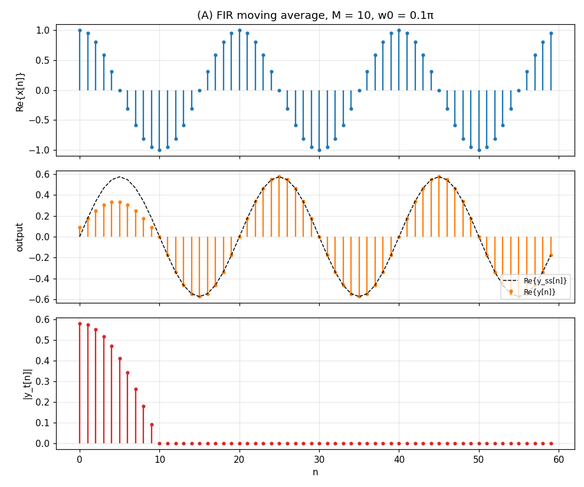
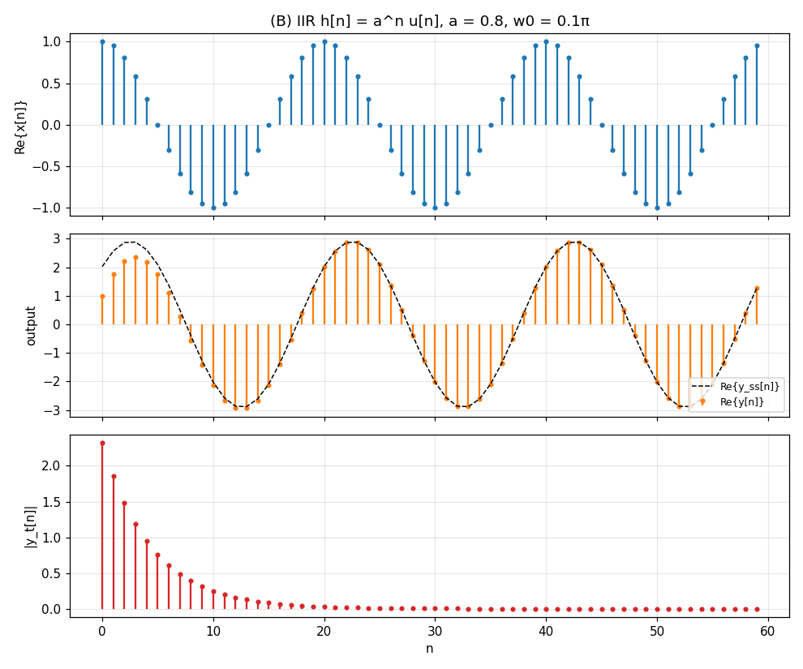
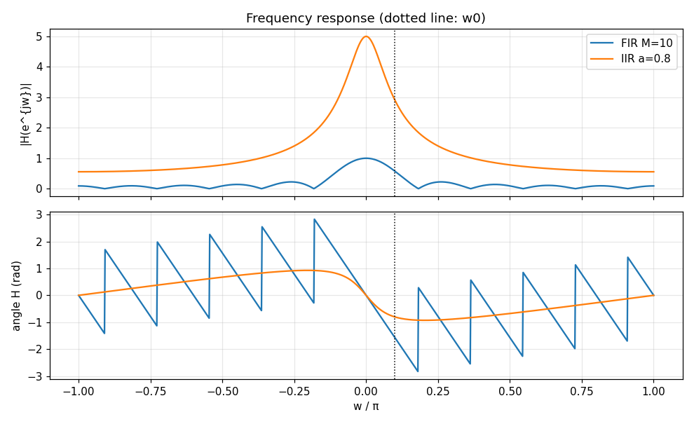

# Day-4（第 4 週）：LTI 系統的頻率響應、暫態與穩態

[← day03_speech_signal_representation.md](day03_speech_signal_representation.md) ｜ [講義目錄](README.md)


- 日期：2026/10/1（第 4 週，週四）
- 課本：O&S Ch. 2.6（頻率響應）、2.7（DTFT）、2.9（DTFT 性質）、3.1（z 轉換）
- 今天的主線：把 complex exponential 丟進 LTI 系統 → 得到頻率響應 → 如果輸入是「突然加上去」的，輸出 = 穩態 + 暫態 → 頻率響應就是 impulse response 的 DTFT → DTFT 不夠用時，換成 z 轉換。
- 課堂示範程式：[demos/day04_transient_steady.py](demos/day04_transient_steady.py)（numpy、matplotlib；本節的圖都由它產生）

## 1. 回顧：連續時間的相子

[Day-2 講義](day02_continuous_to_discrete.md)用相子分析 RC 電路：輸入 $`V_{in}(t)=V_pe^{j\omega t}`$，輸出是同一個頻率的弦波，只被乘上一個複數

```math
H(\omega)=\frac{1}{1+j\omega RC}
```

振幅變成 $`|H(\omega)|`$ 倍，相位多了 $`\angle H(\omega)`$。今天要問同一個問題的離散版本：

> 一個離散時間 LTI 系統，輸入 $`x[n]=e^{j\omega n}`$，輸出是什麼？

## 2. Complex exponential 是 LTI 系統的特徵函數（eigenfunction）

LTI 系統由 impulse response $`h[n]`$ 完全描述，輸出是卷積：

```math
y[n]=\sum_{k=-\infty}^{\infty}h[k]\,x[n-k]
```

令輸入對所有 $`n`$ 都是 $`x[n]=e^{j\omega n}`$（$`-\infty<n<\infty`$），代入：

```math
y[n]=\sum_{k=-\infty}^{\infty}h[k]\,e^{j\omega(n-k)}
=\left(\sum_{k=-\infty}^{\infty}h[k]\,e^{-j\omega k}\right)e^{j\omega n}
=H(e^{j\omega})\,e^{j\omega n}
```

其中

```math
H(e^{j\omega})=\sum_{k=-\infty}^{\infty}h[k]\,e^{-j\omega k}
```

稱為系統的**頻率響應**（frequency response）。重點：

- 輸出仍是**同一個頻率** $`\omega`$ 的 complex exponential，只是乘上一個（與 $`n`$ 無關的）複數 $`H(e^{j\omega})`$。這就是「特徵函數／特徵值」：$`e^{j\omega n}`$ 進去，$`H(e^{j\omega})e^{j\omega n}`$ 出來。
- 寫成極座標 $`H(e^{j\omega})=|H(e^{j\omega})|e^{j\angle H(e^{j\omega})}`$：振幅乘上 $`|H|`$，相位加上 $`\angle H`$。和連續時間的相子完全同一件事。
- $`H(e^{j\omega})`$ 對 $`\omega`$ 以 $`2\pi`$ 為週期，因為 $`e^{-j(\omega+2\pi)k}=e^{-j\omega k}`$。所以只需要看 $`-\pi<\omega\le\pi`$；$`\omega=0`$ 附近是低頻，$`\omega=\pm\pi`$ 附近是最高頻。

### 2.1 實數弦波輸入

若 $`h[n]`$ 是實數，則 $`H(e^{-j\omega})=H^*(e^{j\omega})`$。把實數弦波拆成兩個 complex exponential：

```math
x[n]=A\cos(\omega_0n+\phi)=\frac{A}{2}e^{j\phi}e^{j\omega_0n}+\frac{A}{2}e^{-j\phi}e^{-j\omega_0n}
```

分別通過系統再相加，得到

```math
y[n]=A\,|H(e^{j\omega_0})|\cos\!\left(\omega_0n+\phi+\angle H(e^{j\omega_0})\right)
```

這就是為什麼 HW1 的 `sine_wav_gen.c` 要同時輸出 sine 與 cosine：左右聲道合起來就是 $`e^{j\omega n}`$ 的實部與虛部。

## 3. 突然加上的 complex exponential：穩態與暫態

實際上訊號不會從 $`n=-\infty`$ 就存在。WAV 檔從第 0 個取樣開始，相當於輸入

```math
x[n]=e^{j\omega n}\,u[n]
```

假設系統是因果的（$`h[n]=0`$ for $`n<0`$），對 $`n\ge0`$：

```math
y[n]=\sum_{k=0}^{n}h[k]\,e^{j\omega(n-k)}
=\left(\sum_{k=0}^{\infty}h[k]e^{-j\omega k}\right)e^{j\omega n}
-\left(\sum_{k=n+1}^{\infty}h[k]e^{-j\omega k}\right)e^{j\omega n}
```

第一項就是 $`H(e^{j\omega})e^{j\omega n}`$。所以

```math
y[n]=\underbrace{H(e^{j\omega})\,e^{j\omega n}}_{y_{ss}[n]\ \text{穩態}}
\;+\;\underbrace{\left(-\sum_{k=n+1}^{\infty}h[k]e^{-j\omega k}\right)e^{j\omega n}}_{y_t[n]\ \text{暫態}}
```

- **穩態**（steady state）$`y_{ss}[n]`$：就是第 2 節「輸入一直存在」的答案。
- **暫態**（transient）$`y_t[n]`$：因為輸入是突然開始的，系統「記憶」中還沒有 $`n<0`$ 的輸入，少算了 $`k>n`$ 的那些項。

暫態的大小有一個簡單的上界：

```math
|y_t[n]|\le\sum_{k=n+1}^{\infty}|h[k]|
```

右邊是 impulse response 的「尾巴」。所以**暫態持續多久，取決於 $`h[n]`$ 有多長**：

| 系統 | $`h[n]`$ 的長度 | 暫態 |
|---|---|---|
| FIR，$`h[n]=0`$ for $`n>M`$ | 有限 $`M+1`$ 點 | $`n\ge M`$ 時 $`y_t[n]=0`$，之後完全是穩態 |
| IIR 且穩定（$`\sum\vert h[k]\vert <\infty`$） | 無限長 | 尾巴趨近 0，暫態**逐漸衰減**，理論上永遠不會剛好為 0 |
| 不穩定 | 無限長且不可加總 | 暫態不會消失，甚至發散；穩態沒有意義 |

### 3.1 例子 A：FIR 移動平均

```math
h[n]=\begin{cases}\dfrac{1}{M+1}, & 0\le n\le M\\[4pt] 0, & \text{otherwise}\end{cases}
```

頻率響應（等比級數求和）：

```math
H(e^{j\omega})=\frac{1}{M+1}\sum_{k=0}^{M}e^{-j\omega k}
=e^{-j\omega M/2}\,\frac{\sin\big(\omega(M+1)/2\big)}{(M+1)\sin(\omega/2)}
```

下圖 $`M=10`$、$`\omega_0=0.1\pi`$。中間是輸出（橘）與穩態（黑虛線），下面是 $`|y_t[n]|`$：前 10 點有暫態，**從 $`n=M=10`$ 起暫態恰好為 0**，輸出和穩態完全重合。



### 3.2 例子 B：IIR，$`h[n]=a^nu[n]`$，$`|a|<1`$

```math
H(e^{j\omega})=\sum_{k=0}^{\infty}\left(ae^{-j\omega}\right)^k=\frac{1}{1-ae^{-j\omega}}
```

暫態也可以用等比級數算出來：

```math
y_t[n]=-\left(\sum_{k=n+1}^{\infty}a^ke^{-j\omega k}\right)e^{j\omega n}
=-\frac{\left(ae^{-j\omega}\right)^{n+1}}{1-ae^{-j\omega}}\,e^{j\omega n},
\qquad
|y_t[n]|=\frac{|a|^{n+1}}{|1-ae^{-j\omega}|}
```

暫態以 $`|a|^n`$ 的速度**指數衰減**。$`|a|`$ 越接近 1，衰減越慢、暫態越長。下圖 $`a=0.8`$：



兩個系統在 $`\omega_0`$ 的頻率響應（虛線）就決定了穩態的振幅與相位：



觀察 FIR 的相位圖：除了以 $`2\pi`$ 為單位的折返（主值 principal value），在 $`|H|=0`$ 的地方還有 $`\pi`$ 的跳躍，因為 $`\sin(\cdot)`$ 那一項在那裡變號。下週講 linear phase 與 unwrap 時會再回來看。

### 3.3 實務意義

- 用 FIR 濾波一段音樂時，**最前面 $`M`$ 個取樣**是暫態。濾波器越長（$`M`$ 越大），頻率選擇性越好，但暫態也越長、延遲越大。這是 HW2 Part B 要你用實驗觀察的現象。
- 若輸入在 $`n=N_0`$ 突然結束，結尾也會有類似的暫態（輸出還會再「拖」$`M`$ 點）。所以 $`N`$ 點輸入經過 $`M+1`$ 點 FIR，完整輸出是 $`N+M`$ 點。
- 判斷「輸出是否已進入穩態」：看 impulse response 的尾巴是否已經可以忽略。

## 4. DTFT：頻率響應就是 impulse response 的傅立葉轉換

第 2 節的 $`H(e^{j\omega})`$ 是從 $`h[n]`$ 算出來的。把同一個運算用在任何序列上，就是**離散時間傅立葉轉換**（DTFT）：

```math
X(e^{j\omega})=\sum_{n=-\infty}^{\infty}x[n]\,e^{-j\omega n}
\qquad\qquad
x[n]=\frac{1}{2\pi}\int_{-\pi}^{\pi}X(e^{j\omega})\,e^{j\omega n}\,d\omega
```

反轉換的意義：任何（夠好的）序列都可以寫成無限多個 complex exponential $`e^{j\omega n}`$ 的疊加，權重是 $`X(e^{j\omega})\,d\omega/2\pi`$。再配合第 2 節，**每個頻率成分各自被乘上 $`H(e^{j\omega})`$**，所以

```math
y[n]=x[n]*h[n]\quad\Longleftrightarrow\quad Y(e^{j\omega})=X(e^{j\omega})\,H(e^{j\omega})
```

時域卷積變成頻域相乘。這是整門課最重要的一條式子。

### 4.1 DTFT 何時存在

| 條件 | 收斂方式 | 例子 |
|---|---|---|
| $`\sum_n\vert x[n]\vert <\infty`$（絕對可加總） | 均勻收斂，$`X(e^{j\omega})`$ 連續 | $`a^nu[n]`$，$`\vert a\vert <1`$；所有有限長序列 |
| $`\sum_n\vert x[n]\vert ^2<\infty`$（能量有限） | 均方收斂，可有跳躍 | 理想低通 $`h_{lp}[n]=\dfrac{\sin\omega_cn}{\pi n}`$ |
| 都不滿足 | 用 impulse（廣義函數）表示 | $`e^{j\omega_0n}`$ 對所有 $`n`$：$`2\pi\sum_r\delta(\omega-\omega_0+2\pi r)`$；$`u[n]`$：$`\frac{1}{1-e^{-j\omega}}+\pi\sum_r\delta(\omega+2\pi r)`$ |
| 不存在 | — | $`a^nu[n]`$，$`\vert a\vert >1`$ |

穩定 LTI 系統的定義正好是 $`\sum|h[n]|<\infty`$，所以**穩定系統的頻率響應一定存在且連續**。

理想低通濾波器只滿足第二列：它的 $`h[n]`$ 無限長、非因果，而且不能直接實作。把它截斷成有限長度時，頻率響應在截止頻率附近會出現漣波（Gibbs 現象），截斷越長漣波越窄但高度不會消失。這就是 HW2 Part B 與 HW3 要加窗的原因。

### 4.2 常用性質（O&S Table 2.1、2.2）

| 時域 | 頻域 |
|---|---|
| $`ax_1[n]+bx_2[n]`$ | $`aX_1(e^{j\omega})+bX_2(e^{j\omega})`$ |
| $`x[n-n_d]`$ | $`e^{-j\omega n_d}X(e^{j\omega})`$ |
| $`e^{j\omega_0n}x[n]`$ | $`X(e^{j(\omega-\omega_0)})`$ |
| $`x[n]*h[n]`$ | $`X(e^{j\omega})H(e^{j\omega})`$ |
| $`x[n]h[n]`$ | $`\dfrac{1}{2\pi}\displaystyle\int_{-\pi}^{\pi}X(e^{j\theta})H(e^{j(\omega-\theta)})d\theta`$ |
| $`x[n]`$ 為實數 | $`X(e^{-j\omega})=X^*(e^{j\omega})`$ |
| Parseval | $`\displaystyle\sum_n\vert x[n]\vert ^2=\frac{1}{2\pi}\int_{-\pi}^{\pi}\vert X(e^{j\omega})\vert ^2d\omega`$ |

時移性質解釋了例子 A 的 $`e^{-j\omega M/2}`$：對稱的 FIR 等於一個以 $`n=M/2`$ 為中心的對稱序列，延遲 $`M/2`$ 點，所以相位是線性的。

## 5. 往 z 轉換走一步

DTFT 只用到 $`e^{j\omega}`$，也就是複數平面上的**單位圓**。把它換成任意複數 $`z=re^{j\omega}`$：

```math
X(z)=\sum_{n=-\infty}^{\infty}x[n]\,z^{-n}
=\sum_{n=-\infty}^{\infty}\left(x[n]\,r^{-n}\right)e^{-j\omega n}
```

z 轉換就是「先乘上 $`r^{-n}`$ 再做 DTFT」。$`r^{-n}`$ 可以把原本發散的序列壓下來，所以 z 轉換能處理 DTFT 處理不了的序列。讓級數收斂的 $`z`$ 的集合叫做**收斂區域**（region of convergence, ROC）。

### 5.1 例子：$`a^nu[n]`$

```math
X(z)=\sum_{n=0}^{\infty}\left(az^{-1}\right)^n=\frac{1}{1-az^{-1}},\qquad \text{ROC: } |z|>|a|
```

- 若 $`|a|<1`$：ROC 包含單位圓，令 $`z=e^{j\omega}`$ 就得到第 3.2 節的 $`H(e^{j\omega})`$。
- 若 $`|a|>1`$：DTFT 不存在，但 z 轉換仍然存在，只是 ROC 不含單位圓。
- 對照：$`-a^nu[-n-1]`$ 的 z 轉換是**同一個式子** $`\dfrac{1}{1-az^{-1}}`$，但 ROC 是 $`|z|<|a|`$。所以 **z 轉換一定要連 ROC 一起寫**，否則無法唯一決定序列。

### 5.2 把今天的東西串起來

例子 B 的系統可以寫成 LCCDE

```math
y[n]=a\,y[n-1]+x[n]
```

兩邊做 z 轉換（時移 $`n_0`$ 點 ↔ 乘上 $`z^{-n_0}`$）：

```math
Y(z)=az^{-1}Y(z)+X(z)\quad\Rightarrow\quad H(z)=\frac{Y(z)}{X(z)}=\frac{1}{1-az^{-1}}
```

$`H(z)`$ 在 $`z=a`$ 有一個**極點**（pole）。對照第 3.2 節：

| 極點位置 | 暫態 $`\vert y_t[n]\vert \propto\vert a\vert ^{n}`$ | 單位圓在 ROC 內？ | DTFT／頻率響應 | 系統 |
|---|---|---|---|---|
| $`\vert a\vert <1`$ | 指數衰減 | 是 | 存在 | 穩定 |
| $`\vert a\vert >1`$ | 發散 | 否 | 不存在 | 不穩定 |

**極點離單位圓多近，決定暫態衰減多慢；極點在單位圓內，系統（因果時）才穩定。** 下週正式進入 Ch. 3：z 轉換的性質、ROC、反 z 轉換與系統函數。

## 6. 課堂練習（不需繳交）

1. $`h[n]=\delta[n]-\delta[n-1]`$。求 $`H(e^{j\omega})`$ 並畫出 $`|H|`$。它是低通還是高通？輸入 $`e^{j\omega n}u[n]`$ 時暫態持續幾點？
2. 例子 B 中 $`a=0.8`$、$`\omega_0=0.1\pi`$。從 $`n`$ 等於多少開始，$`|y_t[n]|`$ 小於 $`|y_{ss}[n]|`$ 的 1%？改成 $`a=0.95`$ 呢？
3. 把例子 B 改成 $`a=-0.8`$，$`|H(e^{j\omega})|`$ 的形狀會怎麼變？用示範程式驗證。
4. 修改 [demos/day04_transient_steady.py](demos/day04_transient_steady.py)，讓輸入在 $`n=40`$ 停止，觀察結尾的暫態有幾點。

## 7. 課後待辦（第 4 週）

1. HW1 截止 10/8（四）18:00。B1–B2 與今天第 2–3 節是同一組概念的連續時間版本，請對照著寫。
2. 執行示範程式，改 $`M`$、$`a`$、$`\omega_0`$ 看暫態與穩態怎麼變。
3. 預習 O&S Ch. 3.1–3.3。

---

[← day03_speech_signal_representation.md](day03_speech_signal_representation.md) ｜ [講義目錄](README.md)
