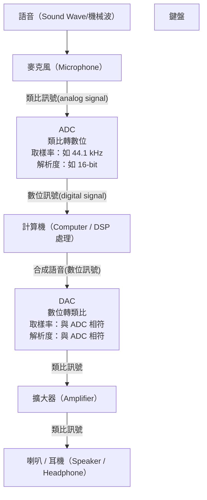

# DSP 2026 課堂講義（第 1–3 週聯集版）

授課教師：江振宇 副教授，[語音暨多媒體訊號處理實驗室（SMSPL）](https://web.ntpu.edu.tw/~cychiang/)，國立臺北大學通訊工程學系。

本講義將教師歷年 HackMD 筆記聯集整理為一份，依上課順序排列：

| 部分 | 週 | 內容 | 原始來源 |
|---|---|---|---|
| [第一部分](#第一部分day-1introduction-to-dsp) | 1 | 課程介紹：DSP 應用、歷史、教科書、評分 | [2021](https://hackmd.io/DuawpzgGTAm1pr1ewb6NSA)、[2022](https://hackmd.io/kdVyXcDLQ9yV7OxeIiVlEg) |
| [第二部分](#第二部分day-2from-continuous-to-discrete) | 2 | 從連續到離散：複數與相子、R/L/C 相位關係、阻抗、RC 低通濾波器、以離散模擬連續 | [2021/2024](https://hackmd.io/PkyN4-shQRujFfkdpUT8dg)，源自[「交流電、電阻、電抗、阻抗」](https://hackmd.io/@cychiang-ntpu/Hk3nWkcKd) |
| [第三部分](#第三部分語音信號的表示補充教材) | 3 | 語音信號的表示：麥克風、ADC、傅立葉轉換、窗函數、spectrogram | [HackMD](https://hackmd.io/l9hfP04-Sgm76bunMz05JQ)（編修中） |

歷年作業「Filtering: Steady and Transient States」（2024）另置於
[assignments/archive/](../../assignments/archive/2024_hw3_filtering_steady_transient/)。

說明：圖片由 imgur／HackMD 代管；GeoGebra 互動圖與「歷史上課影片」（2021 年錄影）以連結提供。
成績結構與時程一律以 [course_plan.md](../course_plan.md) 為準。

---

# 第一部分：Day-1 Introduction to DSP

- 日期：2026/9/10（第 1 週，週四）
## 1. 第一眼看 DSP

### 與 Multimedia 脫不了關係
可複習「多媒體訊號處理」課程
[Chapter-1](https://github.com/cychiang-ntpu/ntpu-ce-mmsp-2020/tree/master/Chapter-1#1-introduction-to-multimedia-signal-processing)。

### Why digital?
- Analog vs. digital?
- Continuous vs. discrete?
- 類比系統與數位系統的優缺點

可複習「多媒體訊號處理」課程
[Chapter-2](https://github.com/cychiang-ntpu/ntpu-ce-mmsp-2020/tree/master/Chapter-2#2-digital-data-signal-representation)。

---

## 2. 由 DSP 晶片供應商來看

### 德州儀器（Texas Instruments, TI；TXN-US）
- [Digital signal processors (DSPs) – Overview](https://www.ti.com/product-category/microcontrollers-processors/microprocessors-dsp/overview.html)：TI DSP 產品線與應用領域（音訊、雷達、汽車 ADAS、Edge AI、航太國防）
- [Audio & radar DSP SoCs](https://www.ti.com/product-category/microcontrollers-processors/microprocessors-dsp/audio-radar-dsp-socs/overview.html)
- 白皮書：[Demystifying digital signal processing (DSP) programming](https://www.ti.com/lit/pdf/spry281)（TI, SPRY281）
- 補充：[處理器的種類：CPU、GPU、MCU、DSP、MPU 各是什麼？](https://www.stockfeel.com.tw/%E8%99%95%E7%90%86%E5%99%A8-cpu-gpu-mcu-dsp-mpu/)

### 亞德諾（Analog Devices, ADI；ADI-US）
- https://www.analog.com/en/products.html

### 恩智浦半導體（NXP Semiconductors；NXPI-US）
- https://www.nxp.com/

### 飛思卡爾（Freescale，已被 NXP 收購）
- https://zh.wikipedia.org/wiki/%E9%A3%9E%E6%80%9D%E5%8D%A1%E5%B0%94

---

## 3. 應用

### Communication
- Modulation / Demodulation
- Pulse Shaping Techniques
- Delta-Sigma Modulator
- Oversampled D/A and A/D Converters
- Phase Locked Loop
- Software Defined Radio
- Speech Coding
- Digital Filter

### Image / Video Processing
- [Image compression（JPEG）](https://en.wikipedia.org/wiki/Image_compression)
- [Video coding（H.264）](https://en.wikipedia.org/wiki/Video_coding_format)
- Streaming
- [Digital image processing](https://en.wikipedia.org/wiki/Digital_image_processing)
  - Medical images

### Audio
- [Audio compression](https://zh.wikipedia.org/wiki/%E9%9F%B3%E8%A8%8A%E5%A3%93%E7%B8%AE_(%E6%A0%BC%E5%BC%8F))
- Audio filtering / equalization
- Audio enhancement
- Spatial audio processing
  - [Head-Related Transfer Function（HRTF）](https://zh.wikipedia.org/wiki/%E5%A4%B4%E9%83%A8%E7%9B%B8%E5%85%B3%E4%BC%A0%E8%BE%93%E5%87%BD%E6%95%B0)

### Speech
- Speech coding / compression
- Speech enhancement
- Speech recognition
- Speaker recognition
- Hearing aid

### Avionics（航空電子設備）& Defense（國防工業）
- Radar
- Sonar

---

## 4. 歷史

- **17 世紀**：微積分發明 → 以連續變數函數與微分方程描述物理現象 →
  牛頓使用有限差分法（finite-difference methods），即本課程離散時間系統的特例。

  
- **18 世紀**：高斯（Carl Friedrich Gauss）發現快速傅立葉轉換（FFT）的基本原理。
- **1950 年代**：訊號處理主要以類比系統完成；數位電腦已進入企業與實驗室，但速度慢、昂貴、體積大。
- **1950 年代**：數位電腦首次用於 DSP 是在地球物理探勘；受限於取樣頻率，只能把低頻地震訊號錄在磁帶上，
  幾秒的資料要花數分鐘到數小時處理。
- **1950 年代**：因數位電腦的彈性，工程師在做出類比系統之前先用 DSP 模擬它。
  著名例子是 MIT Lincoln Lab 與 Bell Telephone Lab 的 Vocoder 模擬。

  

  > A History of Vocoder Research at Lincoln Laboratory,
  > https://www.ll.mit.edu/publications/journal/pdf/vol03_no2/3.2.1.vocoder.pdf
- **1960 年代**：DSP 系統用來逼近類比訊號處理系統，已可得到很好的類比濾波器近似；
  但速度、成本、體積三個因素，使完整的 DSP 系統仍無法取代類比系統用於語音通訊、雷達處理等。
- **1960 年代**：部分演算法源自數位電腦的彈性，在類比設備上並無對應的實作方式。
- **1965**：Cooley 與 Tukey 公開 FFT，加速了離散時間訊號處理的新觀點 →
  DSP 不再只是類比系統的近似，而有了自己的數學（discrete-time mathematics）。
- **1980 年代**：微處理器的發明，讓 DSP 系統（記憶體、CPU、A/D 與 D/A 轉換）得以低成本實現。

---

## 5. 教科書

Oppenheim, A. V., & Schafer, R. W. (2010). *Discrete-Time Signal Processing* (3rd ed.). Pearson.
ISBN-13: 978-0132067096

---

## 6. 課本章節（Course Outline）

1. Introduction
2. Discrete-Time Signals and Systems
3. The z-Transform
4. Sampling of Continuous-Time Signals
5. Transform Analysis of Linear Time-Invariant Systems
6. Structures for Discrete-Time Systems
7. Filter-Design Techniques
8. The Discrete Fourier Transform
9. Computation of the Discrete Fourier Transform
10. Fourier Analysis of Signals Using the Discrete Fourier Transform
11. Parametric Signal Modeling
12. Discrete Hilbert Transforms
13. Cepstrum Analysis and Homomorphic Deconvolution

本學期實際進度以 Ch. 2–5、7–9 為主，詳見 [course_plan.md](../course_plan.md)。

---

## 7. 評分方式

本學期的成績結構、週次進度與作業截止日，統一以 [docs/course_plan.md](../course_plan.md) 為準。

作業繳交規範（延續歷年做法）：
- 繳交 C（或 Python）原始碼，push 到個人私人 GitHub repo，並邀請 cychiang@mail.ntpu.edu.tw。
- 以 [Markdown](https://markdown.tw/) 撰寫 README.md 記錄作業（推導、圖表、結果分析）。
- 評分重點：程式正確性、原始碼可讀性、文件（README.md）的品質與正確性。

本學期四份作業：

| 作業 | 主題 |
|---|---|
| [HW1](../../assignments/hw1_rc_lowpass/) | Simulation of RC Low-Pass Filter by DSP |
| [HW2](../../assignments/hw2_transform_analysis/) | Transform Analysis |
| [HW3](../../assignments/hw3_sampling_rate_lccde/) | Changing the Sampling Rate（LCCDE） |
| [HW4](../../assignments/hw4_sampling_rate_fft/) | Changing the Sampling Rate（FFT Filters） |

歷年曾出過的題目（供參考）：Generating Sine Waves、RC Low-Pass Filter Simulation、
[Filtering: Steady and Transient States](../../assignments/archive/2024_hw3_filtering_steady_transient/)、
Linear/Minimum Phase Systems、Changing Sampling Rates、FFT Filters。

---

## 8. 上課影片（舊版錄影）

- DSP Day-1: Introduction to DSP (Part-1)：https://www.youtube.com/watch?v=stfz_41kxYE
- DSP Day-1: Introduction to DSP (Part-2)：https://www.youtube.com/watch?v=OFzc7PAKuf4

---

---

## 9. 複習 RC 低通濾波器 → 見第二部分

DSP 需要「訊號與系統」的基礎，而其基礎在於交流電、電阻、電抗、阻抗的觀念。
相關內容已併入本講義[第二部分](#第二部分day-2from-continuous-to-discrete)第 1 節，這也是 HW1 的背景知識。

## 10. 回到 1950 年代：用 DSP 來模擬類比電路 → 見第二部分第 3 節

思考：如何用程式語言模擬 RC 電路，對任何輸入 x(t) 求出 y(t)？
推導見[第二部分](#第二部分day-2from-continuous-to-discrete)第 3 節，即 [HW1](../../assignments/hw1_rc_lowpass/) 的出發點。

---

# 第二部分：Day-2 From Continuous to Discrete

- 日期：2026/9/17（第 2 週，週四）
- 與本學期作業的關係：第 1 節（相子、阻抗、RC 低通濾波器的轉換函數）與第 3 節（以離散訊號模擬 RC 電路）
  是 [HW1](../../assignments/hw1_rc_lowpass/) 題 1–4 的背景知識；第 2 節土製 RLC 濾波器實驗為補充閱讀，本學期不列入作業。

## 1. Very Fundamentals of Continuous Signals and Systems
### 引言一
為什麼要以某一個頻率的正弦 (sin)或餘弦(cos)電壓或電流來分析電路呢？當閱讀以下的內容時，別忘了思考此問題！
> 回顧在數位邏輯實驗中給的 clock 訊號，比如最大振幅是 5V 的方波 (square wave)：
> $$x(t)=2.5+2.5\sum_{k=0}^{K}\frac{4}{\pi}\frac{sin(2\pi (2k+1)ft)}{2k+1}\\K\rightarrow \inf$$

> 就是由不同頻率和振幅組合而成的！
> GeoGebra 互動圖：https://www.geogebra.org/calculator/xdbctsqv

### 引言二
為什麼要學複數 (Complex Number)？在接下來的介紹可以解答這個問題的部分答案！複數在正弦或餘弦交流電路的運算分析中，是一個非常簡單且有利的工具，而在電路中以複數所表示的電壓、電流等物理量，我們通稱之為相子 (phasor)，接下來首先介紹如何使用複數表示某個頻率的交流信號。

---

### 1.1. 複數 (complex number) 和相子 (phasor)

> 歷史上課影片：「交流電、電阻、電抗、阻抗 」系列 - 1 (2021/6)
> 引言一
> 引言二
> 1. 複數 (complex number) 和相子 (phasor)
> 1.1. 以直角座標表示的複數
> 1.2. 以極座標表示的複數
> 1.3. 尤拉表示式 (Euler’s formula)

- 影片：https://www.youtube.com/watch?v=xm51ln3v8-Y

#### 1.1.1. 以直角座標表示的複數
複數 (complex number) 通常我們習慣使用符號 $z$ 表示，而複數在直角座標系統 (Cartesian coordinate system) 的表示法是：
$$z=x+jy\tag1$$
其中 $j$ 定義為 $\sqrt{-1}$，$x$ 稱為實部 (real part)、$y$ 稱為虛部 (imaginary part)，而 $x$ 和 $y$ 為實數 (real number)。我們可以將複數 $z$ 以圖一表示。

**圖一**

通常我們可以用 $Re\{z\}$ 來表示 complex number $z$ 的實部，$Re$ 就是 real 的縮寫，而 $Im\{z\}$ 來表示 complex number $z$ 的虛部，$Im$ 就是 imaginary 的縮寫，所以：

$$x=Re\{z\}\tag2$$

$$y=Im\{z\}\tag3$$

可以特別注意，在圖一裡面，我們將這個複數使用一個向量 (vector) 來代表它在空間中的位置，也就是說，我們把複數當作是一個向量來描述，這個複數是在複數平面 (complex plane, 或稱 z-plane) 上，這個複數平面為一個 2-dimensional (sub)space，這 complex plane 的 basis vectors 就是實數軸 (real axis) 以及虛數軸 (imaginary axis) 所指的方向向量。$x$ 就是虛數 $z$ 投影在 real axis 的投影量，$y$ 就是虛數 $z$ 投影在 imaginary axis 的投影量。real axis 和 imaginary axis 兩個互相正交，就是因為互相正交，才有有趣的特性。

---

#### 1.1.2. 以極座標表示的複數
我們亦可以使用極座標方式來表示複數如下：
$$z=r\cos\theta+j\ r\ sin\theta=r(cos\theta+j\ sin\theta)\tag4$$
其中 $x=r\cos\theta$、$y=r\sin\theta$、$r=(x^2+y^2)^{(1/2)}$ 為半徑 (radius)，$\theta$ 為輻角 (angle)，若 $x$ 為正實數 (positive real number) 則 $z$ 會在第一和第四象限，則
$$\theta=tan^{-1}(y/x)\tag5$$
其中 $tan^{-1}$ 是 arctangent，也就是 $tan$ 的反函數 (inverse function)，若 $x$ 為負實數 (negative real number)，$z$ 在第二和第三象限，則
$$\theta=tan^{-1}(y/x)+\pi\tag6$$

---

#### 1.1.3. 尤拉表示式 (Euler’s formula)
我們亦可用 「尤拉表示式」 (Euler’s formula) 來表示複數，這種表示方法非常方便，並廣泛應用於訊號處裡的領域裡面，Euler’s formula 為：
$$e^{j\theta}=cos\theta+j\sin\theta\tag7$$
因此接下來便可以利用數學式(7)來表示複數數學式(4)的複數 $z$：
$$z=x+jy=r(cos\theta+j\ sin\theta)=re^{j\theta}\tag8$$
**很重要!!** 數學式(8)可以很簡潔地表示一個複數。

複數之間的加減法，要先轉化成直角座標表示後，實部與實部、虛部與虛部相加(減)後即可，比如：
$$z_1=r_1e^{j\theta_1}=r_1(cos\theta_1+j\ sin\theta_1)=r_1cos\theta_1+j\ r_1 sin\theta_1=x_1+jy_1\tag9$$

$$z_2=r_2e^{j\theta_2}=r_2(cos\theta_2+j\ sin\theta_2)=r_2cos\theta_2+j\ r_2 sin\theta_2=x_2+jy_2\tag{10}$$

$$z=az_1+bz_2=a(x_1+jy_1)+b(x_2+jy_2)\\=(ax_1+bx_2)+j(ay_1+by_2)\tag{11}$$
其中 $a$ 以及 $b$ 都是任意實數，所以 $z$ 的實部為 $ax_1+bx_2$，$z$ 的虛部為 $ay_1+by_2$。而相乘或相除，則以尤拉表示式運算較方便，例如兩複數相乘：
$$z_1z_2=(r_1e^{j\theta_1})(r_2e^{j\theta_2})=(r_1r_2)e^{j\theta_1}e^{j\theta_2}=(r_1r_2)e^{j(\theta_1+\theta_2)}\tag{12}$$
或兩複數相除：
$$z_1/z_2=\frac{r_1e^{j\theta_1}}{r_2e^{j\theta_2}}=\frac{r_1}{r_2}\frac{e^{j\theta_1}}{e^{j\theta_2}}=(r_1/r_2)e^{j(\theta_1-\theta_2)}\tag{13}$$

---

#### 1.1.4. 相子 (Phasor)
Phasor 是用來描述同一個頻率下$cos$和$sin$的共同表示方法及工具

> 歷史上課影片：「交流電、電阻、電抗、阻抗 」系列 - 2 (2021/6)
> 1.4. 相子 (Phasor)

- 影片：https://www.youtube.com/watch?v=Qd4CT9nfJQI

在定義好以尤拉表示式的複數之後，接下來我們便可利用此表示式來表示一個正弦信號：
$$S(t)=V_0sin(\omega t+\phi)=Im\{V_0e^{j(\omega t+\phi)}\}\tag{14}$$

其中

$$V_0e^{j(\omega t+\phi)}=V_0cos(\omega t+\phi)+jV_0sin(\omega t+\phi)\tag{15}$$

我們也可以用以下數學是來表示ㄧ個餘弦信號：
$$C(t)=V_0cos(\omega t+\phi)=Re\{V_0e^{j(\omega t+\phi)}\}\tag{16}$$

因為數學式(14)裡面的複數 $V_0e^{j(\omega t+\phi))}$ 就是在 z-plane 這個 space 裡面，$x=Re\{V_0e^{j(\omega t+\phi)}\}$ 就是在 real axis 上的投影量，$y=Im\{V_0e^{j(\omega t+\phi)}\}$ 就是在 imaginary axis 上的投影量。

以實際生活上的例子來說，台灣家用電就是振幅為 $110\sqrt2$ Volts 或 $220\sqrt2$ Volts 的 60 Hz交流電，以數學來表示就是這個信號 $S(t)$：

$$S(t)=110\sqrt{2}sin(2\pi \cdot 60 \cdot t+\phi)=Im\{110\sqrt{2}e^{j(2\pi \cdot 60 \cdot t+\phi)}\}\tag{17}$$

其中 $V_0$ 為振幅：
$$V_0=110\sqrt2\tag{18}$$
> 有沒有覺得很奇怪，一般不是說家用電是 110 V 嗎？為什麼振幅是 $110\sqrt{2}$？ 請自行去找到答案。

$\omega$ 為角頻率(angular frequency)：
$$\omega=2\times \pi\times f\tag{19}$$

$$f=60 \text{(unit: Hz)}\tag{20}$$

$t$ 是時間，單位為秒 (second)，$\phi$ 稱為相位 (phase)，值域範圍通常考慮 $(-\pi,\pi]$ 或是 $[0, 2\pi)$。正弦($sin$)以及餘弦($cos$)如果用 Euler 表示的話，可以是一樣的數學形式，比如說餘弦 $C(t)$ 也可以使用 Euler 的 $Im\{\}$ 來表示：

$$C(t)=V_0cos(\omega t+\phi)=V_0sin(\omega t+\phi+\frac{\pi}{2})=Im\{V_0e^{j(\omega t+\phi+\frac{\pi}{2})}\}\tag{21}$$

可以觀察到數學式(21)的 $C(t)$ 和數學式(14)的 $S(t)$ 可以使用一樣的數學形式 $Im\{Ve^{j\theta}\}$ 表示，所以簡單來講，$sin$ 以及 $cos$ 差別只在相位，可以用一樣的 Euler's formula 來表示之，所以我們可以把這個複數 $V_0e^{j(\omega t+\phi)}$ 當作向量 $\vec{V}$ 來表示，這樣的表示方法就是「相子」(Phasor)：

$$\vec{V}=V_0e^{j(\omega t+\phi)}\tag{22}$$

我們還是可以利用 $Im\{\cdot\}$ 以及 $Re\{\cdot\}$ 這兩個 operators 來把 $S(t)$ 以及 $C(t)$ 由 phasor 還原回來，也就是：

$$S(t)=Im\{\vec{V}\}\tag{23}$$

$$C(t)=Re\{\vec{V}\}\tag{24}$$

如果把 $C(t)$ 要從 phasor 以 $Im\{\}$ 這個 operator 轉換回來，我們可利用數學式(21)改寫數學式(24)變成：

$$C(t)=Im\{V_0e^{j(\omega t+\phi+\frac{\pi}{2})}\}=Im\{V_0e^{j(\omega t+\phi)}e^{j(\frac{\pi}{2})}\}\\=Im\{\vec{V}e^{j(\frac{\pi}{2})}\}\tag{25}$$

使用 phasor 表示的數學式(25) $\vec{V}e^{j(\frac{\pi}{2})}$ 就是原本數學式(23) $\vec{V}$ 的相位(phase)偏移(shift)版本，或著說 $Im\{\vec{V}e^{j(\frac{\pi}{2})}\}$ 信號是 $Im\{\vec{V}\}$ 信號的延遲(delay)版本，或著說 $C(t)$ 相對於 $S(t)$ 超前了 $\frac{\pi}{2}$。

---

##### 重點！
**所以使用 phasor 可以將 $cos$ 訊號 ($C(t)$) 和 $sin$ 訊號 ($S(t)$) 可以使一樣的表示方法 (如數學式(23)以及(25))，方便表示以及計算。**

---

#### 1.1.5 相子的應用

**同樣頻率**的弦波相加減

> 歷史上課影片：「交流電、電阻、電抗、阻抗 」系列 - 3 (2021/6)
> 1.5. 相子的應用

- 影片：https://www.youtube.com/watch?v=m3EyOTck12Y

###### 1.1.5.1. Example 1
相位圖使得交流電的運算方便了許多，下面的例子就是一個很好的證明。若有兩個同角頻率的弦波信號：
$$V_A(t)=V_0sin(\omega t)\tag{26}$$

$$V_B(t)=V_0sin(\omega t+\frac{2\pi}{3})\tag{27}$$

$$V_C(t)=V_A(t)-V_B(t)=?\tag{28}$$
> GeoGebra 互動圖：https://www.geogebra.org/calculator/dtjwrz4s

***注意！1.5.1 以及 1.5.2 的解法交互比對來看，便可以了解 1.5.1 的簡便方法之原理。***

###### 1.1.5.1.1. 高中程度解法（積化和差、和差化積）

###### 1.1.5.1.2. 學過相子的大學解法（向量！）

##### 1.1.5.2. Example 2
相位圖使得交流電的運算方便了許多，下面的例子就是一個很好的證明。若有兩個同角頻率的弦波信號：
$$V_A(t)=2sin(\omega t+\frac{2\pi}{3})\tag{29}$$

$$V_B(t)=sin(\omega t-\frac{2\pi}{3})\tag{30}$$

$$V_C(t)=V_A(t)+V_B(t)=?\tag{31}$$

Ans:

> GeoGebra 互動圖：https://www.geogebra.org/calculator/aaxcemuy

---

#### Problems (2021/6/1)

$$X(t)=\sqrt{3} cos(w t-\frac{1}{3}\pi)$$

$$Y(t)=3 sin(w t+\frac{2}{3}\pi)$$

##### Problem 1
請用積化和差/和差化積計算 $Z(t)=X(t)+Y(t)$。將手寫結果掃瞄或照相。

##### Problem 2
請用 phasor 計算 $Z(t)=X(t)+Y(t)$。將手寫結果掃瞄或照相。

Solutions:

##### Problem 3 
使用 [GeoGebra](https://www.geogebra.org/) 繪製 $X(t)$、$Y(t)$、以及 $Z(t)$，將你繪製好的 GeoGebra 圖形連結製作成 QR Code，放在繳交作業的 pdf 檔裡。
> GeoGebra 互動圖：https://www.geogebra.org/calculator/qyqwwk8s

---

### 1.2. 交流電路中電流與電阻、電感、電容的相位關係

> 歷史上課影片：「交流電、電阻、電抗、阻抗 」系列 - 4 (2021/6)
> 回顧「引言一」：square wave (方波)
> 2.1 電阻的電流與電壓關係

https://youtu.be/quCMmtgoHe4

- 影片：https://www.youtube.com/watch?v=quCMmtgoHe4

#### 1.2.1 電阻
###### 1.2.1.1 以弦波計算
如圖四所示，交流電流 $I(t)=I_psin(\omega t)$ 流經一電阻 $R$，由歐姆定律知，通過電阻 a、b 兩端的電壓降為 $V_R(t)=I(t)R$，得到：
$$V_R(t)=I_p R sin(\omega t)\tag{32}$$

> GeoGebra 互動圖：https://www.geogebra.org/calculator/t4ymsqeq

---

##### 1.2.1.2 以 phasor 計算

若用“相子”表示數學式(32)，得到：
$$\vec{V_R}=\vec{I} R\tag{33}$$
>  注意！ $\vec{V_R}$ 和 $\vec{I}$ 是線性關係！

其中
$$\vec{V_R}=I_p R e^{j \omega t}\tag{34}$$
$$\vec{I}=I_p e^{j \omega t}\tag{35}$$
圖五顯示 $\vec{V_R}$ 和 $\vec{I}$ 的相位圖，很明顯地上圖中的電流與電阻是同相位的，也就是沒有**相位差**的意思。

---

#### 1.2.2 電感

---

> 歷史上課影片：「交流電、電阻、電抗、阻抗 」系列 - 5 (2021/6)
> 2.2 電感的電流與電壓關係

- 影片：https://www.youtube.com/watch?v=NYgt0UxRXHk

##### 1.2.2.1 以弦波計算

交流電路中電感的效應與電阻不同，如圖六所示，假設一交流電流 $I(t)=I_psin(\omega t)$ 流經一電感 $L$，由電感之特性我們知道通過電感 a b 兩端的電壓降 ($V_L=V_a-V_b$) 為：

$$V_L(t)=L\frac{d I(t)}{dt}=L I_p \omega cos(\omega t)=I_p L\omega sin(\omega t + \frac{\pi}{2})\tag{36}$$
> GeoGebra 互動圖：https://www.geogebra.org/calculator/pd7yxzz7

很明顯地上式中的電流與電感的相位差是 $\frac{\pi}{2}$，而且是電感的相位超前電流 $\frac{\pi}{2}$。在圖七中表示出電流與電感的相位關係。

---

##### 1.2.2.2 以 phasor 計算

將數學式 (36) 的 $V_L(t)$和 $I(t)$ 可用相子表示：
$$\vec{V_L}=I_p \omega L e^{j(\omega t+\frac{\pi}{2})}=I_p \omega L e^{j\omega t}e^{j\frac{\pi}{2}}=(j\omega L)I_p e^{j\omega t}\tag{37}$$

$$\vec{I}=I_p e^{j\omega t}\tag{38}$$

若將 $V_L(t)$ 和 $I(t)$ 以 $V=IR$ 的方式表示如下：

$$\vec{V_L}=\vec{I} X_L= (I_p e^{j\omega t})(j\omega L)\tag{39}$$
>  注意！ $\vec{V_L}$ 和 $\vec{I}$ 是線性關係！

其中

$$X_L=j\omega L\tag{40}$$

數學式 (40) 裡面的 $X_L$ 就類似直流電路中的電阻，我們稱 為電感 (Inductor) 的電抗 (reactance)，或直接稱為感抗 (inductive reactance)，因此單位也是歐姆 (ohm)，習慣上以符號 $X_L$ 表示，而複數 $j=e^{j\frac{\pi}{2}}$ 表示電感所造成之電位較電流領先 $\frac{\pi}{2}$。

值得注意的是 $X_L=j\omega L$ 亦可表示為

$$X_L=j\omega L=\omega L e^{j\frac{\pi}{2}}\tag{41}$$

其中 $\omega L$ 為實數，代表電壓和電流強度的比值，類似直流電中電阻的物理量，而 $e^{j\frac{\pi}{2}}$ 這個 Euler 表示式，便代表電壓會超前電流 $\frac{\pi}{2}$。

---

##### 1.2.2.3 以函數/訊號與系統說明

將上述之說法用 “信號與系統” 的觀念來看，如圖八所示。

* 可將交流電流 $I(t)=I_psin(\omega t)$ 作為做為一個系統的**輸入信號**，而這個**系統**為一個電感，而這個系統的**輸出信號**為**電位差** $V_L(t)$。
* 使用相子來表示 $\vec{I}=I_pe^{j\omega t}$ 以及 $\vec{V_L}=(j\omega L)\vec{I}$，可以發現到 $\vec{V_L}$ 和 $\vec{I}$ 是線性關係！
* 我們要觀察的輸出電壓就是經過一個函式 $F(\omega, x)$ 的 (線性) 轉換，這個函式的結果會因為不同的 $\omega$ 就有不同的輸出大小。
* 也就是說，不同頻率之信號，就有不同的對應電位差大小，且輸入為一個角頻率為 $\omega$ 的弦波，輸出仍是一個角頻率為 $\omega$ 的弦波。
* 且雖然輸出仍是弦波，但輸出之弦波會超前 (advanced) $\frac{\pi}{2}$。
* 不同頻率的輸入信號，就有不同的增益值 $\omega L$
* 當電流的頻率越高的時候 ($\omega \uparrow$)，則增益值越大 ($\omega L \uparrow$)，代表跨越此電感的電位差增加。
* 若以歐姆定律 ($V=IR$) 來說明這個關係，$\omega L$ 便類似電阻的物理量，也就是說對於角頻率為 $\omega$ 的弦波來說，電阻值 (以感抗值稱之較為精確) 是 $\omega L$。
* 頻率越高的時候 ($\omega \uparrow$ )，感抗值越大 ($\omega L \uparrow$)，代表高頻的交流電流較無法通過電感，因此造成電感兩端較大的電位差。
* 反之，頻率越低的時候 ($\omega \downarrow$)，感抗值越小 ($\omega L \downarrow$)，代表低頻的交流電流較容易通過電感。

> (思考：無限大的電位差，其實就是代表電流無法通過此電感的意思，也就是開路 (open circuit)，而電位差較小，可能代表電流可較無阻礙地的通過電感) 

---

#### 1.2.3 電容

> 歷史上課影片：「交流電、電阻、電抗、阻抗 」系列 - 6 (2021/6)
> 2.3 電容的電流和電壓關係

- 影片：https://www.youtube.com/watch?v=H-UgQWw8E2g

##### 1.2.3.1 以 phasor 計算

圖九交流電路中 $I(t)=I_psin(\omega t)$，而電容兩端電位差 ($V_C=V_a-V_b$) 和電容儲存電荷量的關係為 $Q(t)=CV(t)$，而電流 $I(t)$ 和 $Q(t)$ 的關係為：

$$I(t)=\frac{d Q(t)}{dt}=\frac{d(CV(t))}{dt}\tag{42}$$

將電流以相子表示 ($\vec{I}=I_p e^{j\omega t}$)，並對數學式(42)的所有項目對時間積分，我們得：

$$\vec{Q}(t)=\int_{}^{}\vec{I}dt=\int_{}^{}I_p e^{j\omega t}dt=\frac{1}{j\omega}I_pe^{j\omega t}+K=C\vec{V_C}\tag{43}$$

其中 $K$ 為一個與初始條件有關的常數，此初始條件又和某個時間點電容所包含的電荷量 ($Q(t)=Im\{\vec{Q(t)}\}$) 有關，為了分析方便，在此我們設定 $K=0$，也就是將 $t=0$ 這個時間點電容所包含的電荷量設為以下數學式(44)的值：

$$Q(0)=Im\{\frac{1}{j\omega}I_pe^{j\omega t}+K\} \Big|  t=0, K=0 \\
=Im\{\frac{j}{j^2\omega}I_pe^{j\omega\cdot0}+0\}\\
=Im\{\frac{-j}{\omega}I_p\cdot 1+0\}=\frac{-I_p}{\omega}\tag{44}$$

若把 $K$ 設定為 $0$，重新改寫數學式(43)，我們可得一個很簡潔的結果如下式：

$$\vec{V_C}=\frac{1}{j\omega C}I_pe^{j\omega t}=\frac{1}{j\omega C}\vec{I}=\frac{1}{\omega C}e^{j\frac{-\pi}{2}}\vec{I}=\vec{I} X_C\tag{45}$$
>  注意！ $\vec{V_C}$ 和 $\vec{I}$ 是線性關係！

我們稱數學式(45)中的 $X_C=\frac{1}{j\omega C}$ 為電容 (Capacitor) 的電抗 (Reactance)，或直接稱容抗 (Capacitive Reactance)，習慣上以符號 $X_C$ 表示，而複數 $1/j$ 表示電容所造成之電位較電流延遲 (delay) $\frac{\pi}{2}$ (如圖九所示)。值得注意的是 $X_C=\frac{1}{j\omega C}$ 亦可表示為

$$X_C=\frac{1}{j\omega C}=\frac{1}{\omega C}e^{j\frac{-\pi}{2}}\tag{46}$$

其中 $\frac{1}{\omega C}$ 為實數，代表電壓和電流強度的比值，類似直流電中電阻的物理量，而 $e^{j\frac{-\pi}{2}}$ 這個 Euler 表示式，便代表電壓之相位會比電流延遲 (delay) $\frac{\pi}{2}$。
> GeoGebra 互動圖：https://www.geogebra.org/calculator/w79j5ned

---

##### 1.2.3.2 以函數/訊號與系統來說明

* 類似於電感的敘述，若以“信號與系統”的觀念來看，如圖十所示，可將交流電流 $I_p(t)=I_p sin(\omega t)$ 作為做為一個系統的**輸入信號**，而這個**系統**為一個電容，而這個**系統**的**輸出信號**為電位差 $V_C(t)$。
* 我們要觀察的輸出電壓就是經過一個函式 $F(w,x)$ 的轉換，這個函式的結果會因為不同的 $\omega$ 就有不同的輸出大小。
* 使用相子來表示 $\vec{I}=I_pe^{j\omega t}$ 以及 $\vec{V_C}=(\frac{1}{j\omega C})\vec{I}$，可以發現到 $\vec{V_C}$ 和 $\vec{I}$ 是線性關係！
* 也就是說，不同頻率之信號，就有不同的對應電位差大小。
* 且輸入為一個角頻率為  $\omega$ 的弦波，輸出仍是一個角頻率為 $\omega$ 的弦波，且雖然輸出仍是弦波，但輸出之弦波會延遲 (delay) $\frac{\pi}{2}$ 。

* 不同頻率的輸入信號，就有不同的增益值 $\frac{1}{\omega C}$。
* 當電流的頻率越高的時候 ( $\omega \uparrow$)，則增益值越小 ($\frac{1}{\omega C} \downarrow$ )，代表跨越此電容的電位差減少。
* 若以歐姆定律 ($V=IR$) 來說明這個關係，$\frac{1}{\omega C}$ 便類似電阻的物理量。
* 也就是說對於角頻率為 $\omega$ 的弦波來說，電阻值 (以容抗值稱之較為精確) 是 $\frac{1}{\omega C}$。
* 頻率越高的時候 ($\omega \uparrow$)，容抗值越小 ($\frac{1}{\omega C} \downarrow$)，代表高頻的交流電流較容易通過電容，因此造成電感兩端較小的電位差。
* 反之，頻率越低的時候 ($\omega \downarrow$)，容抗值越大 ($\frac{1}{\omega C} \uparrow$)，代表低頻的交流電流較難以通過電容。

---

### 1.3. 阻抗以及其應用
阻抗（electrical impedance）是電路中電阻、電感、電容對交流電的阻礙作用的統稱。阻抗衡量流動於電路的交流電所遇到的阻礙。***阻抗將電阻的概念加以延伸至交流電路領域，不僅描述電壓與電流的相對振幅，也描述其相對相位***。當通過電路的電流是直流電時，電阻與阻抗相等，電阻可以視為相位為零的阻抗。

> 歷史上課影片：「交流電、電阻、電抗、阻抗 」系列 - 7 (2021/6)
> 1. 回顧交流電為什麼用 sin cos 表示
> 2. 回顧流經過電阻、電容、以及電感之電流與電壓之關係
> 3. RC 串聯交流電路簡介

- 影片：https://www.youtube.com/watch?v=e51D-vlVCe4

#### 1.3.1. RC 串聯交流電路
##### 1.3.1.1. RC串聯阻抗

交流電路中的阻抗，是一個複數，例如圖3.1 顯示一個簡單的 RC 串聯的交流電路，其中阻抗 $Z$ 就等於電阻 $R$ 與容抗 $X_C$ 的和，即 $Z=R+Z_C$，也就是：

$$Z=R+\frac{1}{j\omega C}\tag{3.1}$$ 

圖3.1：RC串聯電路

當交流電流流過 $R$ 和 $C$ 串聯的電路時，總電壓降等於電阻所造成的電壓降和電容所造成的電壓降之和，即：

$$V_a-V_b=V_{RC}=V_R+V_C=IR+\frac{Q}{C}\tag{3.2}$$

若以***相子***表示時：

$$\vec{V_{RC}}=\vec{I}R+\vec{I}\frac{1}{j\omega C}=\vec{I}Z\tag{3.3}$$

則 $Z=R+\frac{1}{j\omega C}$ 被稱之為此電路之阻抗。

##### 1.3.1.2 於 RC 串聯電路中**電壓**與**電流**的相對**振幅**及相對**相位**

在這裡我們想要了解以下幾個關係：
1. 跨越過RC的電壓 $V_{RC}$
2. 流經過RC的電流 $I$
3. $V_{RC}$ 和 $I$ 的相對振幅及相對相位

> 歷史上課影片：「交流電、電阻、電抗、阻抗 」系列 - 8 (2021/6)

- 影片：https://www.youtube.com/watch?v=qpQneqZN-7w

類似於之前分析一個電容或是一個電感的方法，考慮一個角頻率為 $\omega$ 的交流電流 $I(t)=I_psin(\omega t)$ 流過 RC 的串流電路，並將此交流電流以相子表示：$\vec{I}=I_p e^{j \omega t}$，所以 $I(t)=Im\{\vec{I}\}$ ，重寫數學式 (3.3) 可得：

$$\vec{V_{RC}}=\vec{I}Z=I_p e^{j \omega t}(R+\frac{1}{j\omega C})\tag{3.4}$$

雖然 RC 串聯電路的總共阻抗 $Z=R+\frac{1}{j\omega C}$ 就是代表電壓 $V_{RC}$ 和電流 $I$ 之間的比值，但由數學式 (3.4) 並沒有辦法明顯且直接觀察出此關係，因此，我們必須將 $Z=R+\frac{1}{j\omega C}$ 改寫成 Euler’s formula 的型式，也就是 $Z=Ae^{j\phi}$，其中 $A$ 就代表電流和電壓相對的振幅比值，而 $\phi$ 就是電壓和電流的相對相位差，可以用以下方法將 $A$ 和 $\phi$ 求出：

$$Z=R+\frac{1}{j\omega C}=R+\frac{j}{j^2\omega C}=R-\frac{1}{\omega C}j\\=\sqrt{R^2+(\frac{1}{\omega C})^2} \exp(j\tan^{-1}(-\frac{1}{\omega RC}))=Ae^{j\phi}\tag{3.5}$$

所以我們得到：

$$A=\sqrt{R^2+(\frac{1}{\omega C})^2}\tag{3.6}$$

$$\phi=\tan^{-1}(-\frac{1}{\omega RC})=-\tan^{-1}(\frac{1}{\omega RC})=-\cot^{-1}(\omega RC)\\=-(\frac{\pi}{2}-\tan^{-1}(\omega RC))=\tan^{-1}(\omega RC)-\frac{\pi}{2}\tag{3.7}$$

由數學式 (3.6) 和 (3.7) 可以發現到相對振福 $A$ 和相對相位 $\phi$ 皆是角頻率 $\omega$、電容值 $C$ 和電阻值 $R$ 的函數，代表說不同頻率的交流電流會造成不同的振幅和相位、不同 RC 參數也會有不同的振幅和相位。如果我們重寫數學式 (3.4)，我們可以得：

$$\vec{V_{RC}}=\vec{I}Z=I_p e^{j \omega t}(R+\frac{1}{j\omega C})=I_p e^{j \omega t}Ae^{j\phi}=AI_p e^{j \omega t+\phi}\\=\sqrt{R^2+(\frac{1}{\omega C})^2}I_p\exp\{j[\omega t+\tan^{-1}(\omega RC)-\frac{\pi}{2}]\}\tag{3.8}$$

最後我們以求取虛部的 operator (Im) 將相子 $\vec{V_{RC}}$ 轉回跨越RC的弦波電壓變化 $V_{RC}(t)$ 得：

$$V_{RC}(t)=Im\{\vec{V_{RC}}\}=Im[AI_pe^{j(\omega t +\phi)}]=AI_p\sin(\omega t+\phi)\\=\sqrt{R^2+(\frac{1}{\omega C})^2}I_p\sin[\omega t+\tan^{-1}(\omega RC)-\frac{\pi}{2}]\tag{3.9}$$

由數學式 (3.9) 可以知道：
1. $V_{RC}(t)$仍是一個角頻率為 $\omega$ 的正弦波
2. $V_{RC}(t)$ 是將原本的電流 $I(t)=I_p\sin(\omega t)$ 增益  $A=\sqrt{R^2+(\frac{1}{\omega C})^2}$ 倍
3. $V_{RC}(t)$ 與電流 $I(t)=I_p\sin(\omega t)$ 兩弦波相位差別為 $\phi=\tan^{-1}(\omega RC)-\frac{\pi}{2}$
4. $\phi$ 會是一個負值，代表電壓 $V_{RC}(t)$ 的相位會較電流 $I(t)$ 延遲。
> GeoGebra 互動圖：https://www.geogebra.org/calculator/mbmgqqyv

#### 1.3.2. RC串聯交流電路之應用- RC低通濾波器 (RC Low-Pass Filter)

> 歷史上課影片：「交流電、電阻、電抗、阻抗 」系列 - 9 (2021/6)

- 影片：https://www.youtube.com/watch?v=J9PVsDiNuaM

https://youtu.be/J9PVsDiNuaM

##### 1.3.2.1 RC 低通濾波器性質推導
圖3.2 RC 電路實現的一個低通電子濾波器，$V_{in}(t)$ 代表輸入的電壓，$V_{out}(t)$ 代表輸出的電壓，$V_{out}(t)$ 將掛載至一個兩端的負載之上，舉例來說 $V_{in}(t)$ 可以是智慧型手機耳機音源線的電壓輸出，而 $V_{out}(t)$ 可以是一個電腦喇叭的輸入音源線，而此 RC 低通濾波器的功能可以將 $V_{in}(t)$ 裡面較高頻的聲音訊號濾除，讓 $V_{out}(t)$ 輸出的電壓只保留較低頻的聲音訊號，這個簡單的電路可以應用於由音源線接至中低音喇叭的線路之中。

圖3.2：以RC電路實現的一個低通電子濾波器
> GeoGebra 互動圖：https://www.geogebra.org/calculator/rzcb2kcf

此簡單電路包括與一個負載 (如喇叭) 串聯的電阻以及與負載並聯的一個電容，由電容的電抗 $X_C=\frac{1}{j\omega C}$ 可得知電容會阻止低頻信號(電流)通過，因此低頻的電流較容易流經負載 (喇叭)，讓電容兩端之電壓振幅較大；反之，較高頻的信號讓電抗 $X_C=\frac{1}{j\omega C}$ 減弱，容易造成電容的兩端短路因而電壓振幅較小。以下我們以數學式來進行驗證：

假設 $V_{in}(t)$ 的輸入電壓為一個角頻率為 $\omega$ 的餘弦波 $V_{in}(t)=V_pcos(\omega t)=Re(V_pe^{j\omega t})$，我們想要知道 $V_{out}(t)$ 的值為何？

首先將 $V_{in}(t)$ 以及 $V_{out}(t)$ 使用相子表示，並依據歐姆定律和克希荷夫電壓定律列出關係式，我們可得：

$$\vec{V_{in}}=V_pe^{j\omega t}=\vec{I}R+\vec{V_{out}}=\vec{I}R+\vec{I}\frac{1}{j\omega C}\tag{3.10}$$

$$\vec{V_{out}}=\vec{I}\frac{1}{j\omega C}=\frac{\vec{V_{in}}}{(R+\frac{1}{j\omega C})}\frac{1}{j\omega C}=\frac{\frac{1}{j\omega C}}{R+\frac{1}{j\omega C}}\vec{V_{in}}=H(\omega)\vec{V_{in}}\tag{3.11}$$

數學式 (3.11) 已將 $\vec{V_{in}}$ 和 $\vec{V_{out}}$ 的關係使用

$$H(\omega)=\frac{\frac{1}{j\omega C}}{R+\frac{1}{j\omega C}}\tag{3.12}$$

這個函數以相乘的形式建立起來，我們稱 ***$H(\omega)$ 為「轉換函數」 （transfer funtion）***。

但是使用 (3.12) 表示會不大容易進行振幅和相位的分析，所以我們改寫此係數成 Euler’s formula可得：

$$H(\omega)=\frac{\frac{1}{j\omega C}}{R+\frac{1}{j\omega C}}=\frac{1}{1+j\omega RC}\\=\frac{1}{\sqrt{1+\omega^2 R^2C^2}e^{j\tan^{-1}(\omega RC)}}\\=\frac{1}{\sqrt{1+\omega^2 R^2C^2}}e^{-j\tan^{-1}(\omega RC)}\tag{3.13}$$

我們可以令：

$$A(\omega)=\frac{1}{\sqrt{1+\omega^2 R^2C^2}}\tag{3.14}$$

以及

$$\phi=-\tan^{-1}(\omega RC)\tag{3.15}$$

然後重寫 (3.11) 可得：

$$\vec{V_{out}}=\frac{1}{\sqrt{1+\omega^2R^2C^2}}e^{-j\tan^{-1}(\omega RC)}V_pe^{j\omega t}=A(\omega)V_pe^{j[\omega t+\phi(\omega)]}\tag{3.16}$$

因此對數學式(3.16)左右邊都取實部，我們可找到：

$$V_{out}(t)=A(\omega)V_p\cos(\omega t+\phi(\omega))\tag{3.17}$$

由數學式 (3.17) 可觀察出來：
1. $V_{out}(t)$ 的振幅為原本 $V_{in}(t)$ 的 $A(\omega)$ 倍
2. $V_{out}(t)$ 的相位和 $V_{in}(t)$ 的相位差為 $\phi(\omega)$
3. $A(\omega)$ 稱為“轉換函數振幅”(Magnitude of Transfer Function)
4. $\phi(\omega)$ 稱為“轉換函數相位”(Phase of Transfer Function)
5. 當 $\omega=0$ 時，輸入的電壓為一個直流電 $V_{in}=V_p\cos(0\cdot t)=V_p$，則 $A(0)=1$ 造成 $V_{out}(t)=V_p$，代表輸出此RC低通濾波器的輸出可讓原本的 $V_{in}=V_p$ 通過此濾波器，讓 $V_{in}=V_{out}=V_p$
6. 如果我們考慮一個極端例子，也就是說極高的頻率 $\omega\to\infty$，則 $\lim_{\omega \to \infty}A(\omega)=0$，代表高頻率的 $V_{in}(t)$無法通過此低通濾波器展現在 $V_{out}(t)$ 的振幅上。
7. 如果對 $A(\omega)$ 做較一般的討論
    * $A(\omega)$ 的最大值發生在 $\omega =0$
    * $A(\omega)$ 隨著 $\omega$ 增加而逐漸變小，代表輸入信號 $V_{in}(t)$ 頻率越高，則越不容易在輸出 $V_{out}(t)$ 觀察到相對的振幅大小
    * 頻率越低的輸入信號，越容易在輸出觀察到，因此，我們稱此RC電路為一個 “RC低通濾波器”。
> GeoGebra 互動圖：https://www.geogebra.org/calculator/sahmbp6n

##### 1.3.2.2 RC 低通濾波器之截止頻率 (Cutoff Frequency)

截止頻率的定義為轉換函數的振幅由最大值下降至 $\frac{1}{\sqrt{2}}$ 倍時的頻率，或輸出平均功率為最大平均功率 $\frac{1}{2}$ 時侯的頻率，也就是可以找到一個 $\omega=\omega_c$ 讓 $A(\omega_c)=\frac{1}{\sqrt{2}}$，由數學式 (3.14) 可以知道 ，若輸入信號為

$$V_{in}=V_p\cos(\omega_c t)\tag{3.18}$$

則輸出信號為
$$V_{out}(t)=\frac{1}{\sqrt{2}}V_p\cos(\omega_c  t-\tan^{-1}(1))\tag{3.19}$$

## 2. Continuous/Analog World：土製 RLC 濾波器的實驗模擬（補充閱讀）

> 本節為 2021 年「訊號與系統」課程的實作題，保留供有興趣的同學參考；本學期不列入作業。

### 2.1. 實驗目的：
1. 了解電阻的特性 
$$R=\frac{\rho L}{A}\tag{1}$$
其中 $\rho$ 代表電阻係數、$A$ 代表截面積、$L$ 為長度。
2. 了解電容的特性
$$C=\frac{\kappa\epsilon_0 A}{d}\tag{2}$$
其中 $\kappa$ 為介電係數(dielectric constant)、$\epsilon_0$ 為真空環境為準的介電常數(permittivity of free space)、$A$ 代表平行電極板的重疊面積、$d$ 代表兩電極板之間的距離。
3. 了解交流電、電阻、電抗、阻抗的意義
4. 理解 RLC 低通濾波器的工作原理
5. 了解怎麼在真正實驗前做「模擬」，「謀定而後動」，「工程施作前都可以精密計算」！

### 2.2. 實驗材料：
1. 烤肉用鋁箔紙 (可作為平行電極板，亦可作為土製電阻的兩端接點使用)
2. 多張 A4 紙張 (可作為 dielectric 電介質)
3. 口紅膠 (可做為黏著電極板和電介質用、亦可做電介質)
4. 保鮮膜 (可作為 dielectric 電介質)
5. 迴紋針 (作為電容或電阻兩端電極接點使用，所以要是全金屬的)
6. 2B 鉛筆 (可做成電阻使用)
7. 釘書機+訂書針 (可做固定土製電阻兩端的鋁箔紙電極使用)
8. 單芯或多芯電線

### 2.3. 實驗設備及工具：
1. 函數產生器
2. 示波器
3. 剝線鉗
4. 鴨嘴鉗

---

### 2.4. 基本題：RC Low-Pass Filter 製作

回答以下 Problems 1-6 (每一題都 15 Points)

請利用以上列出的實驗材料設計出如圖一所示的 RC low-pass filter，以符合以下之規格 (specification/spec)：
1. $lim_{\omega \to 0} V_{out}(t)=5$
2. $lim_{\omega \to \infty} V_{out}(t)=0$
3. 輸入一個 8,000Hz 的弦波 $V_{in}(t)=5\cos(2\pi\cdot 8000t)$，輸出為 $V_{out}(t)=\frac{5}{\sqrt{2}}\cos(2\pi\cdot 8000t-\frac{\pi}{4})$

#### 2.4.1. Problem 1 
請設計一組 $R$ 以及 $C$ 的值，符合以上的 spec，建議值 $R\in[1\times 10^4, 2\times 10^4] \Omega$，$C \in [10^{-9}, 10^{-8}] \text{F}$。

Solution: 
因為要讓 $f=8000Hz$ 的弦波通過低通濾波器之後的振幅是原本的 $1/\sqrt2$ 倍，所以要讓 $1/\sqrt{1+(2\pi 8000RC)^2}=1/\sqrt{2}$，也就是要讓：

$$RC=\frac{1}{2\pi 8000}\approx 1.989436\times 10^{-5}\tag{1.1}$$

所以可以做以下 $R$ 以及 $C$ 的選擇，只要符合數學式(1.1)就好：
1. $R\approx 1.989436\times 10^{4}\Omega=19.8936K\Omega$ 以及 $C\approx 1.0\times 10^{-9} \text{Farad}=1.0 \text{nF(Nanofarads)}$
2. $R\approx 1.0\times 10^{4}\Omega=10K\Omega$ 以及 $C\approx 1.989436\times 10^{-9} \text{Farad}=1.0 \text{nF(Nanofarads)}$

#### 2.4.2. Problem 2
使用 Geogebra 繪製 $V_{in}(t)$ 以及 $V_{out}(t)$，將繪製好的 GeoGebra 圖形連結製作成 QR Code，放在繳交作業的 pdf 檔裡。
> GeoGebra 互動圖：https://www.geogebra.org/calculator/qevjwhbp

#### 2.4.3. Problem 3
若根據 Problem 1 設計的 $R$ 以及 $C$ 參數來製作實體的電阻，電阻使用鉛筆來製作，電容使用鋁箔紙以及紙來製作，請手繪制電阻以及電容的設計圖，說明如何製作？

Solution:
1. 電容：製作電容時，將兩片鋁鉑紙中間放紙張後以迴紋針固定，透過改變紙張大小及厚度來達成目標電容值。

2. 電阻：用 2B 鉛筆筆跡製作電阻，改變筆跡深淺和筆跡寬度以調整電阻值，將單芯線放置於筆跡兩端再用膠帶固定，單芯線的距離越大電阻越大。

#### 2.4.4. Problem 4
續 Problem 3，根據數學式 (1) 以及 (2) 來設計，則數學式 (1) 裡面的 $L$ 和 $A$ 是多少？數學式 (2) 的 $A$ 和 $d$ 是多少？ 請注意 $\rho$ 可以找“碳或石墨”的導電度/電阻率做為數據，而 $\kappa$ 使用“紙”的 dielectric constant。本題需要計算過程，沒有計算過程不計分。另外，$\rho$ 以及 $\kappa$ 的直在哪裡找到的，要附上參考文獻（網址或書都可以），沒有附上參考文獻，本題不計分。

Solution:
1. 根據網路上找到的論文(https://iopscience.iop.org/article/10.1088/1742-6596/1144/1/012165/pdf)，鉛筆的電阻率大概是：
$$\rho=99.94 m\Omega\cdot cm$$
也就是
$$\rho=99.94\times 100 m\Omega\cdot m\approx 10\Omega\cdot m$$
一張A4只的厚度大概 $0.104mm=1.04\times 10^{-4}m\approx 10^{-4}m$ (https://zhidao.baidu.com/question/1372229580220774859.html)，我們假設用2B鉛筆塗在一張A4的紙上，圖成黑色的部份是厚度為 $H$，寬度為 $W$，長度為 $L$，金黃色的部分是迴紋針可以導電，也就是電阻的兩端，所以由導電的迴紋針看進去這個電阻，截面積 $A=HW$，長度是 $L$。

電阻值就可以估計為：
$$R=\frac{\rho L}{HW}=19.8936K\Omega=1.98936\times 10^4\Omega$$
把鉛筆畫在紙上可以假設是A4紙厚度的 $\frac{1}{2}$，也就是 $H=5\times 10^{-5}$ 寬度是$1cm=10^{-2}m$，則長度可以是：
$$L=\frac{RHW}{\rho}=\frac{(1.98936\times 10^4)(5\times 10^{-5})(10^{-2})}{10}=9.9468\times 10^{-3}m\approx 1cm$$
2.因為鋁箔紙中間夾的是A4紙，所以我們要到紙的 dielectric constant $\kappa=1.4$ (https://en.wikipedia.org/wiki/Relative_permittivity)，而A4紙的厚度是 $d=10^{-4}m$，在 $C\approx 1.0\times 10^{-9}F$ 的情況下，兩張鋁箔紙重疊的面積是：
$$A=\frac{Cd}{\kappa \epsilon_0}=\frac{10^{-9}10^{-4}}{1.4\times 8.85418782\times 10^{-12}}=\frac{10^{-13}}{12.395862948\times 10^{-12}}=8.067207617\times 10^{-3}m^2$$
若鋁箔紙是正方形，則邊長為 $\sqrt{A}=0.08981763533 m\approx 9cm$

#### 2.4.5. Problem 5
請手寫推導出以下問題：
若
$$V_{in}(t)=2.5+2.5\sum_{k=0}^{9}\frac{4}{\pi}\frac{sin(2\pi (2k+1)ft)}{2k+1}\tag{3}$$
且 $$f=2000(Hz)\tag{4}$$
則 $$V_{out}(t)=?$$

Solution:

#### 2.4.6. Problem 6
使用 Geogebra 繪製 Problem 5 的 $V_{in}(t)$ 以及 $V_{out}(t)$，將繪製好的 GeoGebra 圖形連結製作成 QR Code，放在繳交作業的 pdf 檔裡。
> GeoGebra 互動圖：https://www.geogebra.org/calculator/wxpw2rpt

從上圖可以發現到，輸出的 $V_{out}(t)$ 比較於 $V_{in}(t)$ 沒有快速上下跳動信號，因為那些快速上下跳動的信號就是頻率比較高的成分， $V_{in}(t)$ 的高頻成分 ($k$ 比較大的部分)，振幅會被衰減的比較嚴重。

---

### 2.5. 進階題：RLC Filter 製作

回答以下 Problems 7-11 (每一題都 15 Points)

#### 2.5.1. Problem 7
如圖二，請求取圖中的 $A(\omega)$ 以及 $\phi(\omega)$

圖2：電阻 (R)、電容(C)、電感(L)串並聯電路

Solution:

#### 2.5.2. Problem 8
續 Problem 7，若 $R=1\Omega$、$L=\frac{1}{2\pi\cdot 8000} \text{Henry}$、以及 $C=\frac{1}{2\pi\cdot 8000} \text{Farad}$，請用 Geogebra 繪製 $A(f)$ 以及 $\phi(f)$，小心！橫軸是用 $f$ 不是用 $\omega$。繪製圖形的時候要調整x/y兩軸的範圍，方便觀察，建議 $f \in [0, 24000]$、$A(f) \in [0, 1]$、以及 $\phi \in [-\frac{\pi}{2}, \frac{\pi}{2}]$。將繪製好的 GeoGebra 圖形連結製作成 QR Code，放在繳交作業的 pdf 檔裡。

Solution for $A(f)$:
> GeoGebra 互動圖：https://www.geogebra.org/calculator/ynbwvh8y

Solution for $\phi(f)$
> GeoGebra 互動圖：https://www.geogebra.org/calculator/xvbucuww

#### 2.5.3. Problem 9
續 Problem 8，請找到 $A(f)$ 這個函數的水平漸近線、以及垂直漸近線。

Solution: 
$A(f)$ 沒有垂直漸近線，只有水平漸近線 $H(f) = 1$

#### 2.5.4. Problem 10
續 Problem 8，若圖2中的 $V_x(t)=V_{in}(t)$ (數學式(3)、(4)的定義)，則 $V_y(t)$ 為何？ 請將數學式寫出來。

Solution:

#### 2.5.5. Problem 11
續 Problem 10，使用 Geogebra 繪製 Problem 10 的 $V_{x}(t)$ 以及 $V_{y}(t)$，將繪製好的 GeoGebra 圖形連結製作成 QR Code，放在繳交作業的 pdf 檔裡。

Solution:
> GeoGebra 互動圖：https://www.geogebra.org/calculator/nbrkmkmj

## 3. Simulation 'Continuous' by 'Discrete'
### 3.1. Simulation of RC Low-Pass Filter by Discrete Signal Processing

以下投影片推導由 x(t) = RC·dy/dt + y(t) 離散化得到
y[n] = (RC/(RC+τ))·y[n−1] + (τ/(RC+τ))·x[n]，即 [HW1](../../assignments/hw1_rc_lowpass/) 式 (8)。

---

# 第三部分：語音信號的表示（補充教材）

- 第 3 週補充閱讀。以語音為例說明取樣、量化、WAV 儲存、DTFT/DFT、窗函數與 spectrogram，
  對應 HW1（取樣率）、HW2（Hanning 視窗與 DTFT）、HW3/HW4（頻譜圖觀察）的背景。
- 原稿仍在編修中，文中「圖？」為尚未編號的圖。

## 1. 語音信號的表示

語音科技大多是靠運行在計算機上的程式語言，也就是要讓計算機來處理語音信號以及文字，以目前最新的 AI 科技，像是 ChatGPT，可接受人說話的語音，語音藉由計算機或手機的麥克風錄音儲存或傳輸至 OpenAI 的伺服器，進行語音辨識後產生文字，然後再進行文字轉語音，將產生的語音信號傳送到使用者的手機或是電腦介面，最後又播放讓使用者聆聽。

而語言障礙者所使用的語音生成裝置（speech generating device, SGD)，其實就是一個文字轉語音的系統；Google 於 2019 年開始針對語言障礙者實驗性的語音辨識系統 Euphonia，其實就是利用先前累積於一般語者（typical speaker) 建立語音辨識的經驗，特別搜集語言障礙者語音，進而設計演算法改善的語音辨識系統。

可以發現到以上的技術，都是使用計算在處理語音以及文字資料，因此我們在這一節就來簡介語音信號是如何在計算機裡面如何被表示、儲存、以及抽取頻譜特徵，了解這一節的內容可以有助於理解使用數位錄音機、手機、平板、個人電腦、筆記型腦等數位設備錄音應該要注意的事項，在採樣語者語音做紀錄時能更確保錄製語音的品質、增加錄製語音的可用性。

圖 1-1 顯示一個目前使用計算機設備處理語音的過程，人說話的聲音是隨時間改變的空氣壓力變化，麥克風將空氣壓力的改變轉換成電壓或電流的改變，也就是所謂的類比信號（analog signal)，接下來使用類比-數位轉換器（analog to digital converter) 將麥克風感應到的類比信號取樣和量化，以方便在裝置中以計算機處理，在這裡裝置泛指計桌電、筆電、手機、平板，計算機就可以使用數學式做運算進行語音辨識，產生文字資訊，然後用螢幕顯示出文字，也可以將此文字資訊再給聊天文字機器人，由聊天文字機器人做自然語言理解再產生輸出文字，我們可以將數位文字再放入文字轉語音系統，產生出數位語音信號，最後再由數位專類比器（digital-to-analog convertet) 將數位訊號轉換成類比訊號，由喇叭或耳機放出合成語音讓使用者聆聽。

##### 圖 1-1

### 1.1 麥克風
麥克風的功能是將聲音在空氣中的振動所造成的力轉換成電的形式，以方便後續紀錄以及保存，以下是麥克風工作的原理：

#### 振膜 (diaphram) 受力
麥克風有多種形式，不管哪一種形式，都會有 diaphram，diaphram 是提供一個物理的表面面積，這個面積用來接受聲音所造成的氣壓改變。

如圖所示。

#### 受力轉換成電信號
麥克風裡面 diaphram 因為氣壓改變而受力移動後，就可以利用以下原理由位移來轉換成電流改變：
1. 法拉第定律：動圈式麥克風原理。diaphram 連動線圈，而線圈附近有磁鐵產生的磁場，磁場的強弱可以用磁力線的密度來表示，當線圈包含的磁力線面積改變的時候，造成線圈所包含的磁通量改變，線圈就會感應出電流，這個動作很像是發電機的動作，只是發電機所感應出的電流方向隨時間改變的比較慢、感應出的電流也比較大，而麥克風中的線圈感應出的電流所時間變化的速度較快，但感應出的電流量很微量。
2. 庫倫力電容充放電：電容式麥克風原理。電容式麥克風有兩個電極板，上面先有電荷充滿，兩個極版上分別有正電荷以及負電荷，也就是形成一個電容的形式，diaphram 因氣壓改變的力而聯動電極板，兩個電極板因受力而改變間距因此造成兩個極板上正負電荷吸引力的改變，當極板比較接近的時候極板上電荷變多，當極板離得比較遠的時候電荷變少，因為電荷變化隨受力位移連動因而產生極板包含電荷數目的改變，也就所謂的電流。

此步驟得到的電訊號是所謂的類比訊號，我們從字面上來看「類比訊號」這個詞，顧名思義就是將原本的音壓變化藉由力轉換成電的過程，最後用隨時間改變電流或電壓「比擬」原本的氣壓力記錄下來。而我們將隨時間改變的物理量記錄下來圖示稱為「波形」（waveform）。

### 1.2 電訊號數位化表示（類比轉數位/ADC）
這個步驟就是所謂類比轉數位的過程，也就是 Anolog to Digital Conversion ，其中 digital 這個詞是來自於 digit 這個詞，來源自拉丁文 digitus，代表手指的意思，手指是可以用來數「數字」的，和數位化表示有很有趣的關係，尤其是可數的有限數量以「整數表示」這件事。電子元件裡面就是一個所寫稱為 ADC 的零件，是 Analog-to-Digital Converter （ADC) 的縮寫，就是進行類比訊號轉為數位訊號的工作。

圖：ADC 的電路符號（[Wikimedia Commons: ADC Symbol.svg](https://commons.wikimedia.org/wiki/File:ADC_Symbol.svg)，Public Domain）

為甚麼要數位化？原因是麥克風輸出的電流以波形記錄下來，是以連續時間點（或是無限時間點）紀錄下不同時間點的電流或電壓數值，所以除了時間點是無限多個點以外，連每一個無限時間點上的電流/電壓值都是無限多的連續數值，但由於計算機系統只能儲存有限數量的資料，簡單來講電腦的儲存空間有限，比如你的電腦硬碟是 512G，RAM是 8G，你的隨身碟是 32G 的容量。所以我們必須將電流(波形)以離散可數的時間點以及離散可數的數值記錄下來，所以會進行以下的動作：

1. 信號放大以及濾波：
因為麥克風的振膜 (diagphram) 和線圈或電容感應出的電流波形數值可能很小，會造成後續處理不方便，所以要先使用電路放大器，將微小的電流放大成後續電路可以處理的數值範圍、或是將不處理的信號頻率濾除，比如較為高頻率且人耳聽不見的訊號。

圖：放大器電路示意（[Wikimedia Commons: Amplifier Circuit Small.svg](https://commons.wikimedia.org/wiki/File:Amplifier_Circuit_Small.svg)，Public Domain）

2. 取樣：在時間軸上取樣成離散取樣點。
使用電路以固定的週期來對連續的波形取值，也就是連續轉離散訊號的過程，簡單來看就是 $x[n]=x(nT_s)=x(\frac{n}{f_s})$，其中 $x(t)$ 這個以小括號表示的訊號 $x$ 為一個時間 $t$ 的函數記錄下來，$t$ 是連續的實數值，有無限個可能的值，而 $T_s$ 就代表取樣週期，$f_s=1/T_s$ 就是所謂的取樣頻率 (sampling frequency)，$n$ 是一個整數，可以被限定總數，也就是可數（countable)，比如如果有一個 1 秒鐘的語音訊號，所以 $0 \le t \le 1$，若取樣率 $f_s=16000$ Hz，則 1 秒鐘內就有 16000 個取樣點，也就是說 $x[n]$ 這個以中括號表示的函數，我們就稱為第 $n$ 個取樣點的取樣值 (sample value)，將數值定義在 $n=0,1,2,...15999$ 的這些離散索引上，對應到原本物理世界的訊號就是 $x[n]=x(\frac{n}{f_s})$ for $n=0,1,2,...,15999$ 。取樣率 $f_s$ 越高，則可以描述的語音訊號頻寬就越寬，可以更精細地描述波型，根據取樣定理，被取樣後的離散信號可以表示最高頻率為 $f_s/2$ 的訊號。

舉一個例子，原本信號為一個音叉敲擊後產生的 440Hz 的 A4 的 tone，所產生的波型可以寫成一下數學式：
$$x(t)=\cos(2\pi ft)$$
其中 $f=440$，如果取樣率 $f_s=8000$，則取樣後的訊號就會變成：
$$x[n]=\cos(2\pi f n)=\cos(\frac{11}{100}\pi n)$$

> 圖？：同一個語音為「中秋」但是不同取樣率的音訊儲存，由上至下分別是 48KHz、16KHz、以及 8KHz 的取樣率，但由於整個音檔大約 0.76 秒，三個不同取樣率的波形各自有 48000\*0.76、16000\*0.76、以及8000\*0.76 個取樣點，在圖中無法細緻被看清楚。

> 圖？：上一圖中 0.483-0.488 sec 的放大觀察，同樣由上至下分別是 48KHz、16KHz、以及 8KHz 的取樣率，三個不同取樣率的波形各自有 48000\*0.005、16000\*0.005、以及8000\*0.005 個取樣點，在圖中可以看到一根一根的取樣點，當取樣率越高的時候，呈現越細緻的波形變化。

3. 量化：取樣點數值離散表示。
得到每秒鐘 $f_s$ 個取樣值之後，這些值仍然是無限多種數值的可能，因為 $x[n]$ 在一個連續的數值範圍內，所以我們要在進行所謂量化的動作，簡單來講就是使用某一個範圍內的整數值來表示無限多種的連續值，最簡單的方法就是將原本離散取樣點的數值線性調整成在一個範圍內，比如 $-1.0 \le x[n] \le 1.0$，也就是所謂振幅正規化後的取樣點，然後再考慮到要使用多少的位元來表示每一個取樣點的值，目前一般錄音的格式裡面，就有提到所謂 16bits 位元深度 (bit depth) 或是解析度 (resolution) 來描述以上「量化」的方法，因為每一個 bit 可以代表兩種離散值，如果有 16 個 bit，就是代表我們可以用 $2^{16}=67732$ 個離散的數值表示語音波型的每一個取樣點。另一種在比較舊的錄音設備種可能還可以看到的 bit depth 是 8 bits，這個情況下只能將由 -1.0 到 +1.0 的數值用 $2^8=256$ 種可能的整數表示。

    我們可以用以下的數學式來表示：
$$\tilde{q}[n]=\mathrm{ROUND}(2^M (\frac{x[n]}{2}))$$

其中 $\frac{x[n]}{2}$ 代表把原本 $x[n]$ 的範圍再調整到 -0.5 到 0.5 的範圍，這個範圍區間值是 1.0，$M$ 代表 bit 數，$2^M$ 是可以表示的離散數值數目，所以該數學式是將 -0.5 到 0.5 之間的數值，轉換成 $2^M (\frac{x[n]}{2})$ 的範圍至 $-2^{M-1}x[n]$ 到 $+2^{M-1}x[n]$ 之間的實數值，$\mathrm{ROUND}()$ 代表四捨五入的動作，因此 $\tilde{x}[n]$ 會是在以下總共 $2^M+1$ 個元素的整數集合 $\{-2^{M-1}, -2^{M-1}+1,...,-1,0,1,...,2^{M-1}-1,2^{M-1}\}$，但由於 $M$ 個 bit 只能描述 $2^M$ 個離散可數元素，因此我們會再把整數 $\tilde{x}[n]$ 再限制到 $\{-2^{M-1}, -2^{M-1}+1,...,-1,0,1,...,2^{M-1}-1,2^{M-1}-1\}$ 的集合裡面，所以最後每一個取樣且再量化的語音信號就可以用 $\hat{q}[n]$ 表示：
    $$\hat{q}[n]=\max\{\min\{2^M-1,\tilde{q}[n]\}, -2^{M-1}\}$$
    而原本信號 $x[n]$ 和量化後還原的信號之間的差異 $e[n]$，我們稱之為量化誤差：
    $$e[n]=\hat{x}[n]-x[n]$$
    其中 $\hat{x}[n]=\frac{\hat{q}[n]}{2^{M-1}}$ 是量化成 $2^M$ 個離散數值後再還原的取樣點數值，希望能夠越接近原本信號 $x[n]$ 越好，當 $M$ 越大的時候，$e[n]$ 就會越接近 0，代表誤差越小，語音波形越不失真。

> 圖？：將圖？的 0.03-0.05 sec 的波形放大進行觀察，由上往下分別是 16 bits 以及 8 bits 表示的波形，可以注意到縱軸也已經方大看正規化振幅的 -0.05 ~ +0.05 之間，可以清楚地看到，這個語音片段的一開始音量較小，對應到 "中秋" 的 “中” 一開頭的 ㄓ，由於 8 bits 只能表示在 -1.0~+1.0 只能用 256 個值表示，可以很明顯看到振幅小的部分波形比較不連續，無法像 16 bits 表示的更為細緻。

4. 編碼：數位化儲存以及傳輸。
為了方便使用計算機系統處理有限長度(藉由取樣)以及有限數值類別(藉由量化)的語音信號，接下來要將離散且量化過的信號 $\hat{q}[n]$ 使用位元儲存起來，所以就是將信號 $\hat{q}[n]$ 的 $-2^M$ 到 $2^M-1$ 共 $2^M$ 個整數值，對應到不同的 $M$ 個位元組合的位元串，比如 $M=8$ 的情況下，每一個語音取樣可以使用 8 bits 表示，可以使用如表？的位元串表示，如果語音訊號的取樣點值序列 $\hat{q}[n]$ 當 $n=0,1,2,3,4$ 分別是 $\{-120, 100, 0, 1, 127\}$ ，則對應的位元表示就是

#### 數位轉類比 
也就是一般所說的 Digital-to-analog Converter，目的是將原本以 0/1 表示的數位信號，還原回類比訊號，過程中在知道每一個取樣點是使用多少 bit 表示之後，還原回量化的取樣點值，然後再依據依據取樣頻率 $f_s$，使用電路將取樣值每 $1/f_{s}$ 秒改變一次電位，再經過濾波器電路濾除因為放置不連續時間點訊號造成的高頻雜訊，這樣就可以還原成類比訊號。簡而言之「數位轉類比」就是「類比轉數位」的反推過程。

在這裡增加不同取樣率、不同 bit depth 但同一個語音樣本的範例。

### 1.3 傅立葉轉換與頻譜

離散傅立葉轉換 (Discrete Fourier Transform, DFT) 是目前計算機中分析信號頻率成分的基礎方法，一般我們在錄音工具中看到的分析頻譜的 FFT (Fast Fourier Transform) 其實就是指 DFT 的快速計算方法，就因為 FFT 的方法廣泛應用於信號頻率成分的分析，因此多數工具直接用 FFT 這個詞來代表分析頻率。

以下我們來介紹 DFT 的基礎原理，我們可以將一段長度為 $N$ 的離散信號 $x[n]$，用 $N$ 個不同頻率的信號以不同向位來表示，如以下數學式表示：

$$x[n]=\frac{1}{N}\sum_{k=0}^{N-1}X[k]\exp(j\omega_kn) \text{ for } n=0,1,2,...N-1$$

其中 $\exp(j\omega_kn)$ 代表為尤拉公式：

$$\exp(j\omega_kn)=\cos(\omega_kn)+j\sin(\omega_kn)$$ 

$j$ 代表虛數，其中的 $\cos(.)$ 以及 $\sin(.)$ 是頻率為 $\omega_k$ 的正絃以及餘絃信號：

$$\omega_k=2\pi(\frac{k}{N})$$

所以由數學式?來看，信號 $x[n]$ 就是由 $N$ 個頻率為 $\omega_k\text{ for }k=0,1,...,N-1$ 的正絃以及餘絃波被放大 $X[k]$ 的倍率後組合而成，而 $X[k]$ 可由以下公式得到：

$$X[k]=\sum_{n=0}^{N-1}x[n]\exp(-j\omega_kn)) \text{ for } k=0,1,2,...,N-1$$

這裡要注意的是 $x[n]$ 只討論長度為 $N$ 的取樣點，也就是説我們只分析一段語音。但一般語音都是連續產生，所以在這裡我們通常使用 DFT 或 FFT 是分析一段大約 5ms 到 40ms 的語音信號，也就是由連續的語音段落切下來一小段，如果是取樣率 16kHz 的語音，我們大概就會分析 $N=80 \text{~} 640$ 個點。5ms - 40ms 大約可以抓到語音的基礎發音特性，比如音高以及口腔形狀的資訊。

看到前面的數學裡面有複數成分，就覺得很複雜，但實際情況， $x[n]$ 語音信號是實數，經果整理之後，可以重寫之後，可以變成：

$$x[n]=\frac{1}{N}\sum_{k=0}^{N-1}|X[k]|\cos((2\pi \frac{k}{N})n+\angle X[k])$$

再仔細看數學式中的 $\cos((2\pi \frac{k}{N})n+\angle X[k])$，我們知道 $\cos(x)=\cos(-x)$ 且 $\cos(2\pi k+x)=\cos(x) \text{ for } k\in integer$，會有以下的特性：

$$
\begin{align*}
\cos((2\pi \frac{N-k}{N})n+\angle X[N-k])&=\cos(- (2\pi \frac{k}{N})n-\angle X[k]))\\&=\cos((2\pi \frac{k}{N})n+\angle X[k]))
\end{align*}
$$

因此，我們根據以上的特性，我們可以重寫數學式?成：

$$
\begin{align*}
x[n]=&\frac{1}{N}|X[0]|\cos((2\pi \frac{0}{N})n+\angle X[0])\\&+\frac{1}{N}\sum_{k=1}^{\lfloor (N-1)/2 \rfloor}2|X[k]|\cos((2\pi \frac{k}{N})n+\angle X[k])\\&
+\frac{1}{N}[N \text{ is even}]|X[\frac{N}{2}]|\cos((2\pi \frac{\frac{N}{2}}{N})n+\angle X[\frac{N}{2}])
\end{align*}
$$

其中 $[]$ 是一個 inversion bracket 的形式，代表如果 $N$ 是偶數會是 1 的值，如果是不是偶數就是 0 的值。我們可以再將數學式？再整理一下成：

$$x[n]=\sum_{k=0}^{\lfloor \frac{N}{2} \rfloor}A[k]\cos(2\pi \frac{k}{N}n+\phi[k]) \text{ for }n=0,1,...N-1$$

這個數學式就可以解釋為：一段長度為 $N$ 的信號 $x[n]$ 可以用 $N/2$ 個餘弦波以不同振幅 $A[k]$ (實數) 以及不同相位 $\phi[k]$ (實數)組合而成。

當 $k=0$ 的時候，$A[0]=\frac{|X[0]|}{N}$ 為信號中的直流成分振幅；當 $k=1,2,...,\lfloor N/2 \rfloor$ 的時候，$A[k]$ 為信號中的交流成分，其中 $A[k]=2|X[k]|$ 當 $k=1,2,...\lfloor N/2 | \rfloor-1$，如果 $N$ 為偶數，則 $A[N/2]=|X[N/2]|$ 否則 $A[\lfloor N/2 \rfloor]=2|X[\lfloor N/2 \rfloor]$。

根據前面講解的取樣過程，我們知道一個在物理世界的頻率為 $f$Hz 的絃波信號 $x(t)=\cos(2\pi ft)$ 經過取樣率為 $f_s$ 的取樣後，所得到的離散信號為：

$$x[n]=x(n/f_s)=\cos(2\pi f n/f_s)=\cos(\omega n)$$

其中 $\omega=2\pi f/f_s$，代入 $\omega=\omega_k=2\pi(\frac{k}{N})$，可以得到離散信號的頻率 $\omega_k$ 對應到連續時間信號的頻率 $f_k$ 是：

$$f_k=\frac{k}{N}f_s$$

而 $x[n]$ 信號可以重寫成：

<!--$$x[n]=\frac{1}{N}\sum_{k=0}^{N-1}X[k]\exp(j2\pi\frac{f_k}{f_s}n)=\sum_{k=0}^{N-1}X[k]\exp(j2\pi(\frac{k}{N}f_s)t)|_t=n/f_s$$-->

$$x[n]=\sum_{k=0}^{\lfloor \frac{N}{2} \rfloor}A[k]\cos(2\pi \frac{f_k}{f_s}n+\phi[k])=\sum_{k=0}^{\lfloor \frac{N}{2} \rfloor}A[k]\cos(2\pi (\frac{k}{N}f_s)t+\phi[k])|_{t=n/f_s}\text{ for }n=0,1,...N-1$$

所以 $x[n]$ 可以解釋為是一個以 $\lfloor \frac{N}{2} \rfloor + 1$個連續信號頻率為 $f_k=\frac{k}{N}f_s \text{ for }k=0,1,2,...,\lfloor \frac{N}{2} \rfloor$Hz 的 $\cos$ 以及波被放大 $A[k]$ 後組合而成。

值得注意的是數學式？中的頻率 $k=0,1,2,...N/2$，代表在連續物理世界裡面可以表示的最高頻率弦波就是 $x[n]=x(t)|_{t=n/fs}=\cos(2\pi \frac{f_s}{2} n/f_s)$，這有隱含了離散信號只能表示最高為 $f_s/2$放Hz 的信號成分，也就是取樣定理提到的特性。

而信號的「頻譜」，就是可以用一張圖顯示，在橫軸上 $k$ 代表頻率，在縱軸上表示該頻率振幅 

$$20\log_{10}A[k]$$ 

（單位：dB)，將 $A[k]$ 放在 $\log_{10}$ 裡面是因為人的聽感對於大小聲是比較和振幅的對數成正比。

我們的人耳對於不同頻率的信號大小聲與否，可以用 log scale 來感覺，所以「大聲」和「很大聲」是差不多大聲，但「小小聲」和「小聲」就很很敏感到差別。所以一般來講，觀察某一段語音信號的頻率成分，就會用以下數學。

為了能夠對應會實際上取樣前的信號頻率，橫軸上 $k$ 其實大概就是對應到以 $\frac{k}{N} f_s$Hz 為中心附近的成分，大致就是描述 $\frac{k-0.5}{N} f_s$Hz 至 $\frac{k+0.5}{N} f_s$Hz 這個頻帶的頻率成分之振幅，因此 $\frac{f_s}{N}=\frac{k+0.5}{N} f_s - \frac{k-0.5}{N} f_s$Hz 就成為「分析頻寬」。因此，如圖分析的變數 $N$ 越多，則頻譜顯示的頻率解析度就越高（越細緻），增加 $N$ 的方法，如果是在取樣頻率不變的情況下，就是增加被分析語音的時間長度（單位是秒），如果是固定被分析語音的時間長度情況下，就要增加取樣頻率 $f_s$。在同一個取樣頻率下，當 $N$ 比較大的時候，稱為窄頻分析，可以比較能夠觀察到有關聲帶振動的 harmonics，而 $N$ 比較小的時候，稱為寬頻分析，可以比較容易觀察到口腔形狀相關的共振腔資訊。

> 窄頻分析 (narrow-band spectrum)：一個語音內容是「中秋」、取樣率為16kHz、位元深度為16bits 的語音檔案，由0.5秒開始截取0.032秒的音段進行頻譜分析，因為是0.032秒的音段，也就是0.5到0.532秒大概是/e/這個發音的音段，總共會有 N=0.032*16000=512 點的信號進行頻譜分析，頻率解析度是 16000/512=31.25Hz，所以在圖中的點就是每隔32.5Hz就打一點 $20\log_{10}A[k]$，在圖中的橫軸已經使用 Hz 為單位表示，其中 $k=0$ 就對應到 0Hz，$k=256$ 就對應到 8000Hz，更一般來講 $k$ 就對應到 $k/512\times 16000$ Hz 的中心頻率。由於頻率解析度還算細緻，所以在圖中的 spectrum 看起來是很像是細緻鋸齒的連線。由於這一段語音是voiced vowel，聲帶有振動，在時間軸上有重複的週期特性，所以在頻譜上可以觀察到基礎頻率（170Hz)以及其他倍頻(340Hz、510Hz、680Hz,,,) 的所產生的固定間隔 peak 點。

> 寬頻分析 wide-band spectrum：同一個語音內容是「中秋」、取樣率為 16kHz、位元深度為 16bits 的語音檔案，由 0.5 秒開始截取 0.004 秒的音段進行頻譜分析，總共會有 N=0.004*16000=64 點的信號進行頻譜分析，頻率解析度是 16000/64=250Hz，所以在圖中的點就是每隔 250 Hz 就打一點 $20\log_{10}A[k]$，在圖中的橫軸已經使用 Hz 為單位表示，其中 $k=0$ 就對應到 0Hz，$k=32$ 就對應到 8000Hz，更一般來講 $k$ 就對應到 $k/64\times 16000$ Hz 的中心頻率。頻率解析度比較差，所以在圖中的 spectrum 會比較是大鋸齒的連線。由於頻率解析度不高，最細解析度只到 250 Hz，而語者的基礎頻率大約 170Hz，因此 250Hz 的頻率解析度是無法觀察到音高有關的頻譜特性，只可以大概抓取到表示口腔形狀相關的頻譜包絡線，也就是很像是原本上一個 narrow-band spectrum 再去找到它的輪廓。

> 窄頻分析(narrow-band spectrum)：由 0.37 秒開始截取 0.032 秒的音段進行頻譜分析，也就是 0.370 到 0.402 秒大概是 [tɕʰ] 這個發音的音段，總共會有 N=0.032*16000=512 點的信號進行頻譜分析，頻率解析度是 31.25Hz。由於頻率解析度還算細緻，所以在圖中的 spectrum 看起來是很像是細緻鋸齒的連線。由於這一段語音是unvoiced consonant，聲帶沒有振動，在時間軸上沒有重複的週期特性，所以在頻譜上也沒有觀察每隔同一個頻率區間有重複出現的 peak。

> 寬頻分析( narrow-band spectrum)：由 0.37 秒開始截取 0.004 秒的音段進行頻譜分析，因為是 0.004 秒的音段，也就是 0.370 到 0.374 秒大概是 [tɕʰ] 這個發音的音段，總共會有 N=0.004*16000=64 點的信號進行頻譜分析，頻率解析度是 16000/64=250Hz，頻率解析度比較差，所以在圖中的 spectrum 會比較是大鋸齒的連線。由於頻率解析度不高，無法觀察到是否有因為聲帶有振動而在頻譜上的 harmonics 呈現。

### 1.4 頻譜與窗函數

前面 1.3 我們將原本長度為 $N$ 的信號 $x[n]$ 做分析，我們也在圖？裡面將原本連續的語音切成長度為 $N$ 再來做頻譜分析，延續這樣的想法，如果直接將數學式？裡面原本定義域範圍變成全部的整數，也就是 $-\inf < n < \inf$，新的信號就變成一個週期為 $N$ 無限延伸的信號：

$$\tilde{x}[n]=x[n] \text{ for } n\in \mathbb{Z}$$

其中 $\tilde{x}[n]$ 符合以下特性：

$$\tilde{x}[n]=\tilde{x}[n+rN] \text{ for } r \in \mathbb{Z}$$

所以 DFT 的分析其實是把截下的 $N$ 點訊號，當作是一個週期為 $N$ 的週期性訊號來處理，所以希望所擷取的短音段 $x[n]$ 是一個「穩定」的信號，但又什麼是「穩定」呢？簡單來說就是具有變化規律的訊號，比如某一個頻率振幅固定的弦波（也就是 tone），這個 tone 就算是截下一段下來，仍需要處理 $x[n]$ 開頭和結尾的地方，希望開頭和結尾經過特殊處理後，讓使用 DFT 分析看到的週期性訊號 $\tilde{x}[n]$ 夠「連續」，就像原本在時間軸上無限延伸且穩定規律變化的樣子，而不要有不連續而產生出和原本訊號不一樣的特性，所以我們必須要讓 $x[n]$ 再由原本要分析的信號裡面截取出來的時候可以乘上平滑的窗函數 $w[n]$，也就是:

$$x[n]=s[n+S]w[n]$$

其中 $w[n]$ 稱為窗函數，在這裡是這個窗函數 $w[n]\neq0 \text{ for } 0\leq n < N$，最常見的窗函數有 Hamming、Hann、以及 Rectangle，$x[n]$ 就是觀察原本連續的長信號 $s[n'] \text{ for } n'=S,S+1,...,S+N-1$ 的這一小段，$S$ 是觀察的開始取樣點。

以下為使用不同窗函數來分析 170Hz 弦波的例子，為什麼只分析一個弦波呢？因為一般的信號可以使用不同頻率的弦波線性疊加而成，所以分析的頻譜結果也可以是不同弦波頻率分析結果的疊加，所以我們這裡化繁為簡，觀察某一個頻率弦波的頻率分析狀況，就可以了解頻率分析的基礎問題。

圖?裡面是一個取樣率為 8000Hz、頻率為 170Hz、normalized 振幅為 0.5 的弦波、長度為 1 sec 的弦波，其中藍色 marked 的地方為 256 點的訊號，如果只看這 256 點，的確是一個穩定的狀況，都是弦波。圖？將圖？中的 256 點的 $x[n]$ 切下來，然後再將其擴展成 periodic signal $\tilde{x}[n]$

> 整個綠色波形是 1 sec=900 sample 點的 170Hz 振福為 0.5 (normalized amplitude) 的正弦波 $s[n]$，被選擇 marked 起來的地方是 $s[n']$ 其中 $n'=1884,1885,...,2139$，是一個 256 點的短信號。

> 將圖?裡面短音段變成週期為 $N=256$ 的週期性信號 $\tilde{x}[n]=x[n]$，上圖為原音 $s[n]$，中圖使用 $w[n]$ 為 rectangle，下圖是 $w[n]$ 為 Hann。 

Rectangle 是很直覺的將信號截下 $N$ 點，雖然 $x[n]$ 和原本 $s[n]$ 最像，但是因為 DFT 其實就是假設在分析一個週期性信號 $\tilde{x}[n]$ 如果觀察這個週期性弦波，會在每一個週期的一開始和一結束的地方有很明顯不連續的取樣點值，如果你聽這個週期性信號，你會聽到明顯的雜音，造成的原因就是這些不連續的點。

> 原音 170Hz 3秒鐘的弦波

> 一個使用 rectangle window 切下信號為一個週期的週期性信號 $\tilde{x}[n]$，時間點為 1.0sec t0 1.032 sec，共256點。

如果你使用 Hann 函數做為窗函數，可以觀察到每一個週期一開始和一結束會平滑的相接，如果你聽這個週期性信號，是不是聽起來比較像原本的 $s[n]$呢？ 以上就可以用很直覺的方式來說明為什麼要把截下的信號乘上窗函數，原因就是要能讓原本要被分析的信號儘量保持其連續特性。

> 一個使用 Hamming window 切下信號為一個週期的週期性信號 $\tilde{x}[n]$，時間點為 1.0sec t0 1.032 sec，共256點。

理想頻率是一根 delta

但是 rectangle 很慘

可以發現到和 DFS 的數學式一樣，如果把 n>=N 或 n<0 整個 x［n) 重新定義domain 就變成週期為 N 的信號。

---

### 1.5 Spectrogram 概述
由於語音訊號會隨時間變化，所以只有在短時間內保持比較一致的特性，如圖?的0.38sec 到 0.42sec 之間都是向雜訊，而 0.45 sec 到 0.48 sec 之間是波型類似的週期性訊號。

為了要同時能夠抓到語音訊號隨時間的改變以及語音訊號某短時間內的穩定特性，很有趣的是以上兩個我們想要的特性，是有點互相牴觸的。

Spectrogram 是分析語音的基礎方法，是先將語音切成許多短時間片段，再利用上一小節所提到的離散傅立葉轉換的方法，來分析語音是如何隨時間變化，分析語音信號所時間改變而有哪些不同的頻率成分組合而成，也就是所謂短時間傅立葉轉換 (short-time Fourier transform)，以語音辨識的角度來講，人的耳朵就像是一些不同頻段的濾波器，代表能接收不同頻率的音訊成分，因而觸發聽覺。以語音合成的角度來講，spectrogram 可以充分且有效率的代表語音信號，所以只要能產生 spectrogram 就能夠在產生語音的取樣點。

以語音辨識的角度來講，人的耳朵就像是一些不同頻段的濾波器，代表能接收不同頻率的音訊成分，因而觸發聽覺。以語音合成的角度來講，spectrogram 可以充分且有效率的代表語音信號，所以只要能產生 spectrogram 就能夠在產生語音的取樣點。

如圖？所示，語音波型會隨時間改變，依序要進行 1) Framing、2) Windowing & Zero Padding、3) Discreate Fourier Transform，最後得到 Spectrogram。

#### Framing
比如在唸「中秋」這個詞的時候會有對應到以下的音IPA序列:
[ʈʂ] [w] [ə] [ŋ]
[tɕʰ] [j] [o] [u̯]
每一個IPA可以對應到不同的語音波型因而有不同聲音可以被區辨出來，我們以「中秋」的「秋」[tɕʰ] [j] [o] [u̯] 這個音節為例子，可以看得出來在每一個「短語音片段」之內都有類似的語音波型特性，比如可以看到似乎有重複出現的波型，或是一樣雜亂沒有明顯重複形狀的波型，如果要描述這樣子的特性，如圖？所示，我們可以將語音「每隔一段時間」，就觀察一個「短語音片段」，也就是圖裡面的 frame 0/1/2/...11，我們稱「每隔一段的時間」為 frame hop，frame hop length 越短則時間上對於信號的變化就描述得越細緻，而「短語音片段」就稱為一個 frame，這個「短語音片段」的長度就稱為 frame length，frame length 越長則可以分析越多信號點，得到越多資訊，然而因為包含的「短時間」可能「過長」因而可能失去時間上的解析度，所以 frame length 的選擇這裡會有因為訊號的特性而有所對於時間解析度和頻率解析度的取捨平衡。

我們可以將 framing 寫成以下的數學式來描述：

$$x_m[n]=x[n+mS]\text{ for } n=0,1,2,...P-1$$

其中 $x_m[n]$ 代表第 $m$ 個 frame 的信號，$S$ 代表 frame hop length，$P$ 代表 frame length。

那麼 frame hop 是多短呢？取決於你分析的訊號特性，還有你想要觀察或模擬什麼？ 對於語音來講，因為語音訊號隨時間會變化，大家習慣上每 5ms ~ 20ms 分析一次某一短時間內訊號。每一個 frame length 習慣上抓取 20ms 到 40ms 的訊號來做進一步分析，通常就是使用上一小節提到的離散傅立葉轉換，觀察 frame 裡面訊號是由哪些不同的弦波頻率成分以哪些不同的強度(magnitude) 以及相位 (phase) 組合而成，一個 20ms 的 frame 可以至少觀察到最低一個頻率為 1000ms/20(ms/cycle) = 50Hz 的一個弦波週期，而 40ms 的 frame 可以觀察到最低到 1000ms/40(ms/cycle) = 25Hz 的弦波。圖？裡面使用的 frame hop length = 10ms，而 frame length = 30ms。

#### Windowing & Zero-padding
由於將信號做 framing 後再做 DFT，在數學上就是將 framing 後的信號變成一個週期為？的信號，所以很像是將 frame 一直重複變成週期性信號來做分析，一些 framing 後的信號在 frame 結束的端點和的 frame 開始的端點的信號會不連續，會造成對於信號的分析的干擾，為了降低此干擾，Windowing 是將原本的信號呈上一個平滑的函數，這樣子可以讓原本每一個 frame 開始以及結束的邊界會逐漸振幅歸零，會讓 framing 的信號重複循環連接看起來是連續平滑的波形，也必較像原本語音波形連續進行特性，這樣連續的函數比較不會干擾頻率上的分析干擾。另外，為了要讓 DFT 計算快速，通常希望給 DFT 計算的取樣點是 $2^N$ 個點，所以如果原本 frame length 的點數不是 $2^N$ 就要將要分析的點數增加到 $2^N$ 個點，比如圖？中的 frame length = 8000\*0.03=240點，要在原本的信號後面補上 16 個數值為 0 的點，再進行 DFT，因為點數是 $2^N$ 個點，就可以進行 Fast Fourier Transform (FFT)，元算的速度可由原本每一個 frame 是 $240^2$ 個乘法，下降只有 $256\log_2(256)$ 個乘法，加速了大約 30 倍，FFT 在 1965 年被發明，是訊號處理的重要事件，影響了之後所有的資通訊產業發展。
#### Discrete Fourier Transform
粗略地看語音波型，可以發現到兩種很極端的特性：「週期特性」以及「非週期特性」。
* 週期特性 (periodic)，如圖？中「秋」的韻母所在的 Frmae 7/9/11的部分對應到發音 [j] [o] 的地方，接近所謂週期性信號 (periodic signal)：
	* 信號過一段時間後又再重複一樣的形狀。
	* 在一段時間內有類似的特性。
	* 可以由多個頻率的弦波組合表示之，根據傅立葉理論，一個週期性的信號可以是 components of fundamental frequency (F0) + harmonics。因此在圖？中可以看到 Discrete Fourier Transform 結果，也就是頻譜 $|X_7(f)|$ 以及 $|X_{11}(f)|$ 在橫軸 (頻率軸) 上每隔一個固定的頻率差，就有 peak 值。
	* 如果一個信號 $x[n]$ 是週期信號 (periodic signal)，則我們可以找到一個最小的數字 $N$ 使得 $x[n]=x[n+N]$
	* 人在發出週期性信號時，聲帶會振動。
* 非週期特性 (aperiodic)，如圖中「秋」這個音節的聲母 [tɕʰ] 所在的 Frame 0/1/2：
    * 很難直接從信號隨時間變化來觀察出規律
    * 像是雜訊 (noise)
    * 人在發出 aperodic signal 時聲帶大多不振動
* Quasiperiodic Signals：其實大部分的語音信號是 Quasiperiodic，也就是介於週期和非週期信號之間，一段短時間的信號會和下一段短時間信號很相似，但不會整一樣，但差距不會很大，這樣的條件，比嚴格的週期性信號定義寬鬆。
   

### 1.6 離散傅立葉轉換的意義（範例：音符序列的 spectrogram）
sample rate = 8000Hz    
tempo = 120 beat/min
音符：：16分音符
"C3", "E3", "G3", "C4", "C3"
    130.81, 164.81, 196.00, 261.63, 130.81 (Hz)
    
每一個音符的音量大小調整成不一樣，來呈現在 spectrogram 上面的不同，如果振幅越大，則在聲紋圖上越亮。

可以發現到原本在時間軸的資料要很密集的每一個 sample 要記錄下來，而時頻譜就可以很有效率的紀錄成更為稀疏的資料，為更有效率地表示方法。

### 1.7 語音特性（待補）

> 以下為原稿的待補筆記。

a i u e o 的頻譜

媽麻馬罵

v oicer unvoiced

---

# 課後待辦（第 1 週）

1. 依 [vscode_c_starter.md](../tutorials/vscode_c_starter.md) 架好 C 開發環境，編譯 [tools/wav_info.c](../../tools/wav_info.c)。
2. 依 [git_intro.md](../tutorials/git_intro.md) 建立個人私人 repo，邀請 cychiang@mail.ntpu.edu.tw。
3. 預習第二部分第 1 節（相子與 RC 低通濾波器），為 HW1 做準備。
